# Vulkan glTF Scene Renderer

|glTF Renderer|
|-------------|
|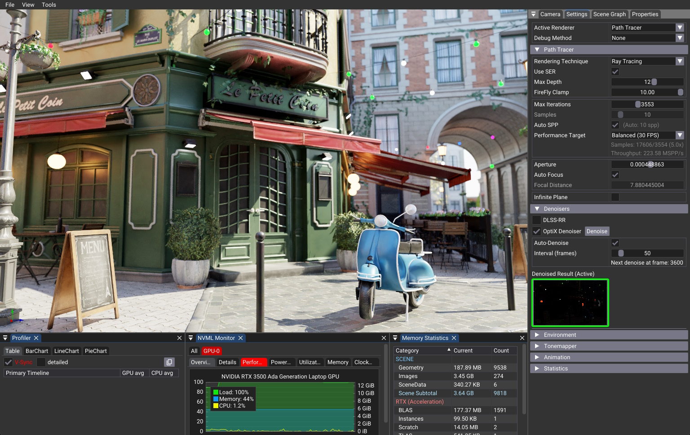|


## Overview

This application demonstrates a dual-mode renderer for glTF 2.0 scenes, implementing both ray tracing and rasterization pipelines. It showcases the utilization of shared Vulkan resources across rendering modes, including geometry, materials, and textures.

## What's New

This version brings significant improvements and modernization:

- **Modern Vulkan Framework**: Now using [Nvpro-Core2](https://github.com/nvpro-samples/nvpro_core2.git) which provides:
  - Vulkan 1.4 support
  - Volk for dynamic Vulkan loading
  - Modern C++ features and improved architecture
  - Enhanced debugging and validation layers
  - Better resource management

- **Slang Shading Language**: Replaced GLSL with [Slang](https://github.com/shader-slang/slang) for:
  - Enhanced shader development experience
  - Better cross-platform compatibility
  - Improved shader debugging capabilities
  - Hot-reloading support (F5)
  - Modern shader language features

- **AI-Accelerated Denoisers**: Added support for NVIDIA's AI denoisers:
  - DLSS Ray Reconstruction (DLSS-RR) - optional, enable with `USE_DLSS`
  - OptiX AI Denoiser - enabled by default when CUDA Toolkit is found (configure with `USE_OPTIX_DENOISER`)

- **Shadow Catcher**: Enhanced infinite plane with physically accurate shadow catching capabilities that subtracts light from the environment and adds reflections where appropriate. The plane surface can be adjusted to mimic the original surface properties: color, roughness, and metallic.

## Key Features

- glTF 2.0 (.gltf/.glb) scene loading
- Pathtracing with global illumination
- PBR-based rasterization
- HDR environment mapping and Sun & Sky simulation
- Advanced tone mapping
- Camera control system
- Extensive debug visualization options
- AI denoisers (DLSS-RR, OptiX)

### UI Highlights
- Drag & drop for glTF/GLB scenes and HDR environments
- Material variants, animation controls, multi-scene support
- Camera presets with save/restore
- Debug channels, GPU profiler, real-time statistics
- Command-line interface for headless/batch rendering

## Dependencies

 - Vulkan SDK ([latest version](https://vulkan.lunarg.com/sdk/home))
 - [Nvpro-Core2](https://github.com/nvpro-samples/nvpro_core2.git) framework
 - [Slang](https://github.com/shader-slang/slang) shading language (included with nvpro_core2)

 ### Optional Dependencies
 - [NVIDIA DLSS SDK](https://developer.nvidia.com/rtx/dlss) (automatically downloaded if `USE_DLSS` is enabled)
 - [CUDA Toolkit](https://developer.nvidia.com/cuda-toolkit) (required for OptiX denoiser)]
 - [Draco Compression](https://github.com/google/draco) (Downloaded automatically if `USE_DRACO` is enabled))
 
## Build Instructions

1. Clone the repositories
```bash
git clone https://github.com/nvpro-samples/nvpro_core2.git
git clone https://github.com/nvpro-samples/vk_gltf_renderer.git
```

2. Build the project
```bash
cd vk_gltf_renderer
cmake -B build -S . -DUSE_DLSS=ON -DUSE_DRACO=ON
cmake --build build --config release
```


3. Run the application
```bash
.\_bin\Release\vk_gltf_renderer.exe
```

4. Install [optional] : if you want to package the application
``` bash
cmake --install .
```
The application supports extensive command-line options for automation and testing. It can run in headless mode (without UI) and save rendered images to disk, making it useful for benchmarking and batch rendering workflows.

Example of headless rendering:
```bash
 ./vk_gltf_renderer.exe --headless shader_ball.gltf daytime.hdr --envSystem 1 --frames 1000
```


### Draco Compression

To enable Draco mesh compression, you need to enable the option CMake. In the GUI interface, you will see the option `USE_DRACO`. If you are using the command line, you can add `-DUSE_DRACO=ON` to the cmake command. This will download the Draco library and it will be included in the project.

### AI-Accelerated Denoisers

This release adds support for NVIDIA's AI-based denoisers, providing state-of-the-art noise reduction for path-traced images with significantly improved image quality and temporal stability.

#### DLSS Ray Reconstruction (DLSS-RR)

[**DLSS Ray Reconstruction**](https://developer.nvidia.com/rtx/dlss) is NVIDIA's latest AI denoiser, offering exceptional quality and temporal stability for ray-traced content.

**How to enable:**

By default, DLSS-RR is **disabled**. To enable it, set the CMake option `USE_DLSS=ON` when configuring the project:

```bash
cmake -DUSE_DLSS=ON ..
```

This will automatically download and integrate the required DLSS SDK. The denoiser will then be available as an option in the renderer.

> **Note:** DLSS-RR requires a compatible NVIDIA GPU (RTX 20 series or newer) and drivers.

#### OptiX AI Denoiser

[**OptiX AI Denoiser**](https://developer.nvidia.com/optix-denoiser) provides high-quality AI-accelerated denoising using albedo and normal guide buffers to preserve fine details while removing Monte Carlo noise.

**How to enable:**

By default, OptiX denoiser is **enabled** if the CUDA Toolkit is found during CMake configuration. If you want to explicitly disable it, set the CMake option `USE_OPTIX_DENOISER=OFF`:

```bash
cmake -DUSE_OPTIX_DENOISER=OFF ..
```

The denoiser will automatically integrate using CUDA-Vulkan interoperability for efficient GPU processing when the CUDA Toolkit is available.

> **Note:** OptiX denoiser requires:
> - [CUDA Toolkit](https://developer.nvidia.com/cuda-downloads) (11.0 or later recommended)
> - Vulkan external memory support
>
> OptiX headers are automatically downloaded during the CMake configuration, so no separate OptiX SDK installation is needed.


## glTF Core features

- ✅ glTF 2.0 (.gltf/.glb)
- ✅ images (HDR, PNG, JPEG, ...)
- ✅ buffers (geometry, animation, skinning, ...)
- ✅ textures (base color, normal, metallic, roughness, ...)
- ✅ materials (PBR, ...)
- ✅ animations
- ✅ skins
- ✅ morphs
- ✅ cameras
- ✅ lights
- ✅ nodes
- ✅ scenes
- ✅ samplers
- ✅ textures
- ✅ extensions

## GLTF Extensions
 Here are the list of extensions that are supported by this application

- ✅ KHR_animation_pointer
- ✅ KHR_draco_mesh_compression
- ✅ KHR_lights_punctual
- ✅ KHR_materials_anisotropy
- ✅ KHR_materials_clearcoat
- ✅ KHR_materials_diffuse_transmission
- ✅ KHR_materials_dispersion
- ✅ KHR_materials_emissive_strength
- ✅ KHR_materials_ior
- ✅ KHR_materials_iridescence
- ✅ KHR_materials_pbrSpecularGlossiness
- ✅ KHR_materials_sheen
- ✅ KHR_materials_specular
- ✅ KHR_materials_transmission
- ✅ KHR_materials_unlit
- ✅ KHR_materials_variants
- ✅ KHR_materials_volume
- ✅ KHR_materials_volume_scatter
- ✅ KHR_mesh_quantization
- ✅ KHR_node_visibility
- ✅ KHR_texture_basisu
- ✅ KHR_texture_transform
- ✅ KHR_xmp_json_ld
- ✅ EXT_mesh_gpu_instancing
- ✅ EXT_meshopt_compression
- ✅ MSFT_texture_dds

## Renderer

There are two renderers: a rudimentary rasterizer and a full featured path tracer.

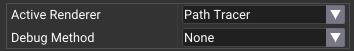

Debug method allow to visualize specific components, like: base color, normal, tangents, texture coordinates, etc.


### Pathtracer

Implements a path tracer with global illumination. 


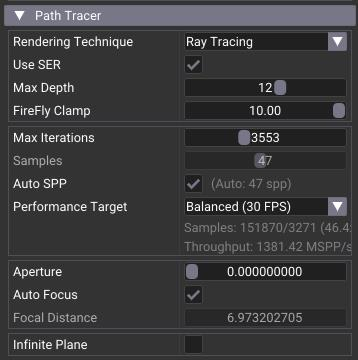

* Renderting Technique: choice between Ray Tracing and Ray Query (Compute)
* Use SER: enabling Shader Execution Reorder for Ray Tracing.
* FireFly Clamp: removes high intensity pixels
* Max Iterations: maximum rendering frames
* Samples: number of samples per pixel in a single frame
* Auto SPP: increase automatically the SSP to reach the FPS 
* Aperture: depth-of-field
* Auto Focus: uses the interest position to compute the focal distance
* Infinite Plane: adds an infinite plane to the scene with optional shadow catcher mode. When shadow catcher is enabled, the plane subtracts light from the environment and adds reflections where appropriate, creating physically accurate shadows and reflections. The plane surface properties (color, roughness, and metallic) can be adjusted to mimic the original surface.

#### Denoisers


There are two denoisers: DLSS-RR, which provides real-time denoising, and the OptiX denoiser, which reduces residual Monte Carlo noise. 

##### DLSS-RR

When activated, you can select the rendering resolution and view guide buffers. Clicking on a guide buffer toggles its display in the main viewport.


##### OptiX

Denoising can be performed manually by clicking the `Denoise` button, or automatically at a defined interval. The denoised image is visible when `Denoise Result` is active, indicated by a green outline.

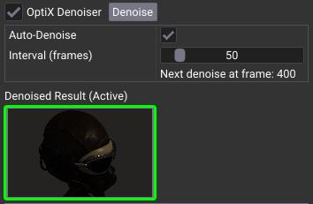


## Raster


The raster renderer does not implement the full glTF PBR model; instead, it serves as a proof of concept to demonstrate data sharing with the path tracer. It utilizes the same Vulkan resources as the path tracer, including:

- Scene geometry
- Material data
- Textures
- Shading functions


Example with wireframe option turned on


## Features

| | | 
|--|--|
| Showcase | 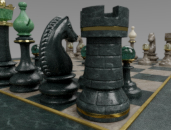 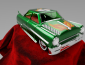 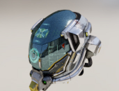 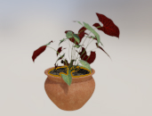 <br>      <br> 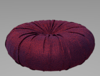   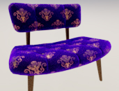 <br>  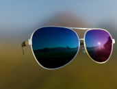|
| Anisotropy | 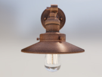 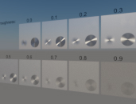 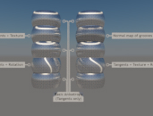  <br> |
| Attenuation |  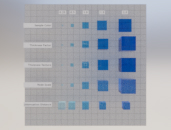|
| Alpha Blend |  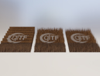 |
| Animation |   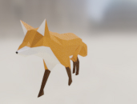 |
| Clear Coat | 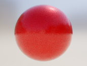   
| Dispersion | 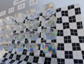 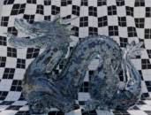 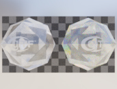 |
| IOR |  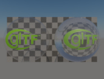 |
| Emissive |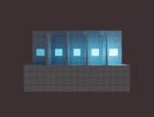  |
| Iridescence |    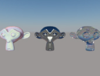 |
| Punctual | 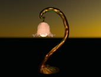  |
| Sheen | 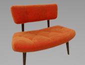 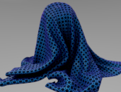   |
| Transmission |     <br>    |
| Variant |  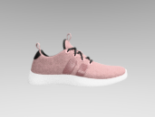  |
| Volume |  |
| Volume Scatter | 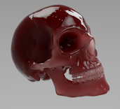 |
| Others | 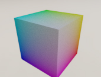  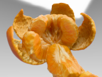  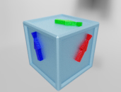 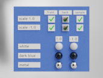 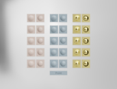    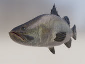 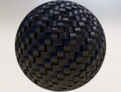 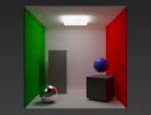 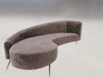   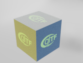   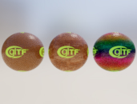   |


## Debug

There is also the ability to debug various out channels, such as:

|metallic|roughness|normal|base|emissive|opacity|tangent|tex coord|
|---|---|---|---|---|---|---|---|
|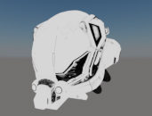|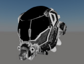||| | | |  |


## Environment

### Sun & Sky

There is a built-in Sun & Sky physical shader module.

 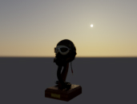 

### HDR 

Lighting of the scene can come from HDRi.

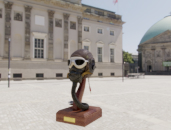 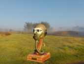  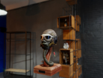 <br> 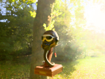  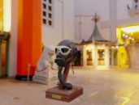 

It is possible to blur HDR to various level.

  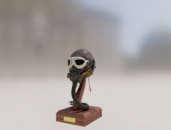 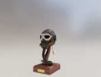

The HDR can also be rotated to get the right illumination.

 

### Background

Background can be also solid color and if saved as PNG, the alpha channel is taking into account. 

  


## Tonemapper

A tone mapper is essential for achieving visually pleasing results. Tone mapping is performed with a compute shader, and various settings are available to adjust the output.


Multiple tonemapper are supported:
* [Filmic](http://filmicworlds.com/blog/filmic-tonemapping-operators/)
* Uncharted 2
* Clip : Simple Gamma correction (linear to sRGB)
* [ACES](https://www.oscars.org/science-technology/sci-tech-projects/aces): Academy Color Encoding System
* [AgX](https://github.com/EaryChow/AgX)
* [Khronos PBR](https://github.com/KhronosGroup/ToneMapping/blob/main/PBR_Neutral/README.md#pbr-neutral-specification) : PBR Neutral Specification


## Camera

The camera navigation follows the [Softimage](https://en.wikipedia.org/wiki/Softimage_(company)) default behavior. This means, the camera is always looking at a point of interest and orbit around it.

### Navigation


### Overview


### Copy / Restore / Save


- Click the home icon to restore the camera to its original position.
- Click the camera+ icon to save a camera; saved cameras are shown below as #1, #2, etc.
- Click the copy icon to store the camera information in the clipboard.
- Click the paste icon to set the camera from information on the clipboard.
- Click a camera number to retrieve that saved camera.


### Navigation modes 


- Orbit: rotates around a point of interest. Double-clicking on an object will re-center the interest point to the clicked position.
- Fly: allows free movement of the camera, and the `w`, `a`, `s`, `d` keys move the camera accordingly.
- Walk: similar to Fly mode, but restricts movement to the horizontal (X-Z) plane.


## Depth-of-Field

Depth of field works only for ray tracing and settings can be found under the `RendererPathtracer>Depth-of-Field`

 


## Configuration

### Settings File

The application creates a `vk_gltf_renderer.ini` file next to the executable, which stores:
- UI layout and window positions
- User interface preferences (e.g., axis visibility, grid display)
- Selected renderer type (raster or path tracer)
- Last used settings and options

If you encounter issues with the UI or want to reset all settings to defaults, it is safe to delete this file. The application will recreate it with default values on the next launch.


----
## Schema of the Program

The nvvk::Application is a class that provides a framework for creating Vulkan applications. It encapsulates the Vulkan instance, device, and surface creation, as well as window management and event handling.

When using `nvvk::Application`, you can attach `nvvkhl::IAppElement` to it and each element will be called for the different state, allowing to customize the behavior of your application. The `nvvkhl::IAppElement` class provides default implementations for these functions, so you only need to override the ones you need.

Here is a brief overview of how `nvvk::Application` works:

### Initialization:
When you create an instance of `nvvk::Application`, it sets up the Vulkan instance, device, and surface. It also creates a window and sets up event handling.

### Attaching Elements
In `main()` we are attaching many elements, like:
* `ElementCamera` : this allow to control a singleton camera
* `ElementProfiler` : allow to time the execution on the GPU
* `ElementBenchmarkParameters` : command line arguments and test purpose
* `ElementLogger` : redirect log information in a window
* `ElementNvml` : shows the status of the GPU

But the main one that interest us, and which is the main of this application is `GltfRendererElement`. This is the one that will be controlling the scene and rendering.


### Main Loop: 
The `nvvk::Application` class provides a main loop that continuously processes events and updates the application state. Inside the main loop, it calls the following functions:

* **onAttach()**:<br> 
This function is called whenever the element is attached to the application. In `GltfRendererElement`, we are creating the resource needed internally. 

* **onDetach()**: <br>
This function is called when the user tries to close the window. You can override this function to handle window close events.

* **onRender(VkCommandBuffer)**: <br>
This function is called to render the frame using the current command buffer of the frame. You can override this function to perform rendering operations using Vulkan. In `GltfRendererElement` this is where the active renderer is called.

* **onResize()**: <br>
This function is called when the `viewport` is resized. You can override this function to handle window resize events. In `GltfRendererElement` the G-Buffer will be re-created

* **onUIRender()**: <br>
This function is called to allow the `IAppElement` to render the UI and to query any mouse or keyboard event. In `GltfRendererElement`, we render the UI, but also the final image. The rendered image is consider a UI element, and that image covers the entire `viewport` ImGui window. 

* **onUIMenu()** <br>
Will be modifying what we see in the the window title. It will also create the menu, like `File`, `Help` and deal with some key combinations.

* **onFileDrop()** <br>
Will receive the path of the file been dropped on. If it is a .gltf, .glb, .obj or .hdr, it will load that file. The file type is determined by its extension - 3D scene files (.gltf, .glb, .obj) are loaded as scenes, while HDR files (.hdr) are loaded as environment maps. 


----

## Scene Graph

The GLTF scene is loaded using tinygltf and then converted to a Vulkan version. The Vulkan version is a simplified version of the scene, where the geometry is stored in buffers, and the textures are uploaded to the GPU. The Vulkan version is used for both raster and ray tracing.

The scene is composed of nodes, where each node can have children and each node can have a mesh. The mesh is composed of primitives, where each primitive has a material. The material is composed of textures and parameters. However, none of this is directly used in the rendering, as we are using a simplified version of the scene.


Once the scene has been loaded, we proceed to parse it in order to collect the RenderNodes and RenderPrimitives. The RenderNode represents the flattened version of the tree of nodes, where the world transformation matrix and the material are stored. The RenderPrimitive, in contrast, represents the unique version of the primitive, where the index and vertex buffers are stored.

RenderNodes represent the elements to be rendered, while RenderPrimitives serve as references to the data utilized for rendering.

### Animation

If there is animation in the scene, a new section will appear under the Scene section.
It allows to play/pause, step and reset the animation, as well as changing its speed.


### Multiple Scene 

If there are multiple scenes,  a new section will appear under the Scene section.
It will show all the scenes and their name. Clicking on a scene name will switch to the scene.


### Material Variant

If there are multiple material variant, a new section will appear under the Scene section.
It will show all the material variant and their name. Clicking on a variant name will apply it on the models.


### Scene Graph UI


It is possible to visualize the scene hierarchy, to select node, to modify their transformation and their material, to some level.

Here's a shorter version of the text, tailored for developers on GitHub:

### Recompiling Shaders
For quick shader testing, use the `Recompile Shaders` button to hot-reload Slang shaders (F5). The shaders are located in the `shaders` folder and are automatically compiled during the build process.

Note: Hot-reloading won't work without the shared libraries and shaders, but the app will still run.

## Tools

The application comes with a few tools to help debug and visualize the scene.

### Profiler

The profiler is a tool that allows to measure the time spent on the GPU. It is possible to measure the time spent on the different stages of the rendering, like the path tracing, the rasterization, the tonemapping, etc.


### Logger

The logger is a tool that allows to see the log information. It is possible to filter the log information by selecting the level of the log.


### Nvml

The Nvml is a tool that allows to see the status of the GPU. It is possible to see the temperature, the power, the memory usage, etc.


### Tangent Space

There is a tangent space tool that lets you repair or regenerate the model's tangent space. This is useful if normal maps look incorrect or there are tangent-related errors in the scene.

- The Simple option uses UV coordinates and implements the method described in https://foundationsofgameenginedev.com/FGED2-sample.pdf
- The MikkTSpace option is more advanced and implements the algorithm from http://www.mikktspace.com/


## Utilities

### gltf-material-modifier.py

Modify materials in a GLTF file and optionally reorient the scene from Z-up to Y-up.

```
usage: gltf-material-modifier.py [-h] [--metallic METALLIC] [--roughness ROUGHNESS] [--override] [--reorient]
                                 input_file output_file
```                                 

positional arguments:
```
   input_file            Path to the input GLTF file.
   output_file           Path to save the modified GLTF file.
```

options:
```
  -h, --help             show this help message and exit
  --metallic METALLIC    Set the metallic factor (default: 0.1).
  --roughness ROUGHNESS  Set the roughness factor (default: 0.1).
  --override             Override existing material values if set.
  --reorient             Reorient the scene from Z-up to Y-up.
```