# Vulkan glTF Scene Renderer


|Pathtracer | Raster|
|:------------: | :------------: |
| |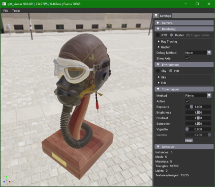|

## Overview

This application demonstrates a dual-mode renderer for glTF 2.0 scenes, implementing both ray tracing and rasterization pipelines. It showcases the utilization of shared Vulkan resources across rendering modes, including geometry, materials, and textures.

## Key Features

- glTF 2.0 (.gltf/.glb) scene loading
- Pathtracing with global illumination
- PBR-based rasterization
- HDR environment mapping and Sun & Sky simulation
- Advanced tone mapping
- Camera control system
- Extensive debug visualization options

## Dependencies

 - Vulkan SDK ([latest version](https://vulkan.lunarg.com/sdk/home))
 - [Nvpro-Core](https://github.com/nvpro-samples/nvpro_core.git) framework

## Build Instructions

1. Clone the repositories
```bash
git clone https://github.com/nvpro-samples/nvpro_core.git
git clone https://github.com/nvpro-samples/vk_gltf_renderer.git
```

2. Build the project
```bash
cd vk_gltf_renderer
mkdir build
cd build
cmake ..
cmake --build . --config release
```

3. Run the application
```bash
.\bin_x64\Release\vk_gltf_renderer.exe
```

4. Install [optional] : if you want to package the application
``` bash
cmake --install .
```


## glTF Core features

- [x] glTF 2.0 (.gltf/.glb)
- [x] images (HDR, PNG, JPEG, ...)
- [x] buffers (geometry, animation, skinning, ...)
- [x] textures (base color, normal, metallic, roughness, ...)
- [x] materials (PBR, ...)
- [x] animations
- [ ] skins
- [x] cameras
- [x] lights
- [x] nodes
- [x] scenes
- [x] samplers
- [x] textures
- [x] extensions

What is currently not supported are animations and skins, multiple textures coordinates, morph targets, color at vertices, and some extensions.

## GLTF Extensions
 Here are the list of extensions that are supported by this application

- [ ] KHR_animation_pointer
- [ ] KHR_draco_mesh_compression
- [ ] KHR_lights_punctual
- [x] KHR_materials_anisotropy
- [x] KHR_materials_clearcoat
- [ ] KHR_materials_dispersion
- [x] KHR_materials_emissive_strength
- [x] KHR_materials_ior
- [x] KHR_materials_iridescence
- [x] KHR_materials_sheen
- [x] KHR_materials_specular
- [x] KHR_materials_transmission
- [x] KHR_materials_unlit
- [x] KHR_materials_variants
- [x] KHR_materials_volume
- [ ] KHR_mesh_quantization
- [ ] KHR_texture_basisu
- [x] KHR_texture_transform
- [ ] KHR_xmp_json_ld
- [x] EXT_mesh_gpu_instancing

## Pathtracer

Implements a path tracer with global illumination. 


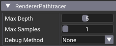

The options are:
* Max Depth : number of bounces the path can do
* Max Samples: how many samples per pixel at each frame iteration
* Aperture: depth-of-field
* Debug Method: shows information like base color, metallic, roughness, and some attributes
* Choice between indirect and RTX pipeline.
* Denoiser: A-trous denoiser 


## Raster

Utilizes shared Vulkan resources with the path tracer, including:

- Scene geometry
- Material data
- Textures
- Shading functions

The options are:
* Show wireframe: display wireframe on top of the geometry
* Super-Sampling: render the image 2x and blit it with linear filter.
* Debug Method: shows information like base color, metallic, roughness, and some attributes

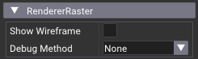

Example with wireframe option turned on

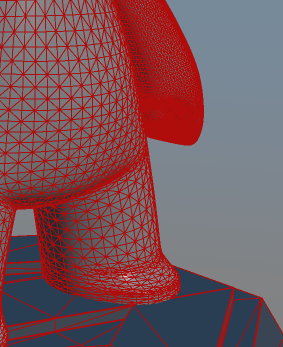

## Debug

There is also the ability to debug various out channels, such as:

|metallic|roughness|normal|base|emissive|
|---|---|---|---|---|
|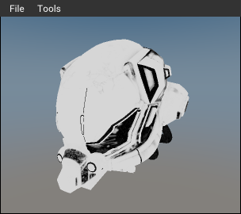|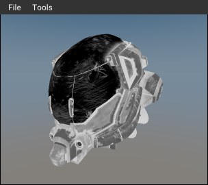|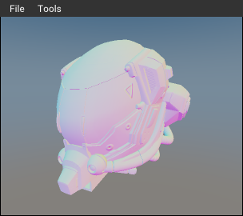|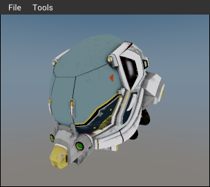|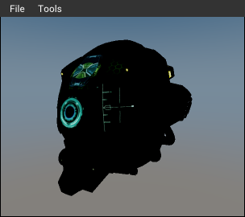|


## Environment

It is possible to modify the environment, either by choosing an integrated sun and sky, or by lighting the scene using Image Base Lighting. In the latter case, you need an image (.hdr). You can find examples of such images at the following address [Poly Haven](https://polyhaven.com/hdris)

| Sun & Sky | HDRi |
| --- | --- |
|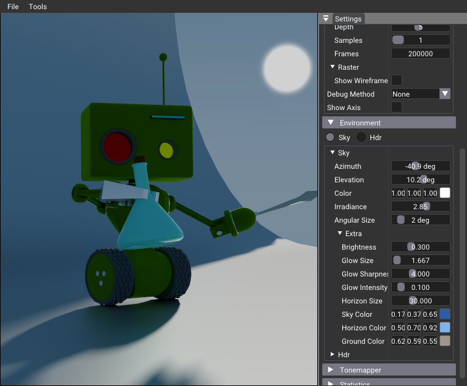 |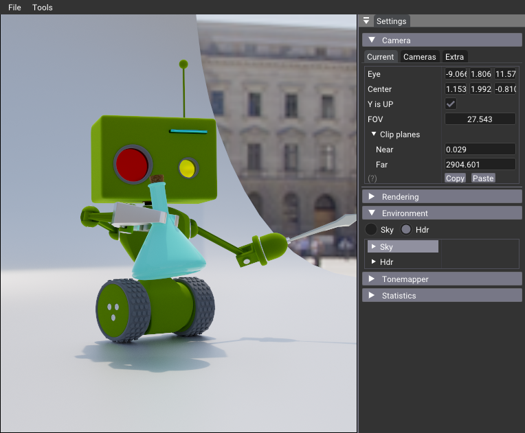|

Having HDRi (High Dynamic Range Imaging) to illuminate the scene greatly simplifies complex lighting environments. It also helps to integrate 3D objects into its environment.

This example loads HDR images, then creates an importance sampling acceleration structure used by the ray tracer and stores the [PDF](https://en.wikipedia.org/wiki/Probability_density_function) in the alpha channel of the RGBA32F image.

For real-time rendering, we use the created acceleration structure and create two cubemaps. One containing the diffuse irradiance and the other, storing the glossy reflection, where the different levels of glossiness are stored in separate mipmap levels.

## Tonemapper

We could not get good results without a tone mapper. This is done with a compute shader and different settings can be made.

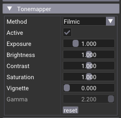

Multiple tonemapper are supported:
* [Filmic](http://filmicworlds.com/blog/filmic-tonemapping-operators/)
* Uncharted 2
* Clip : Simple Gamma correction (linear to sRGB)
* [ACES](https://www.oscars.org/science-technology/sci-tech-projects/aces): Academy Color Encoding System
* [AgX](https://github.com/EaryChow/AgX)
* [Khronos PBR](https://github.com/KhronosGroup/ToneMapping/blob/main/PBR_Neutral/README.md#pbr-neutral-specification) : PBR Neutral Specification


## Camera

The camera navigation follows the [Softimage](https://en.wikipedia.org/wiki/Softimage_(company)) default behavior. This means, the camera is always looking at a point of interest and orbit around it.

Here are the default navigations:

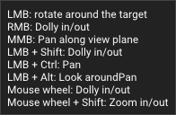

The camera information can be fine tune by editing its values.

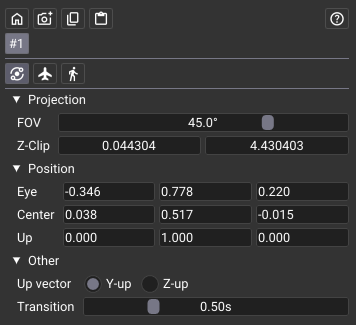

Note: **copy** will copy in text the camera in the clipboard, and pressing the **paste** button will parse the clipboard to set the camera. 

Ex: `{0.47115, 0.32620, 0.52345}, {-0.02504, -0.12452, 0.03690}, {0.00000, 1.00000, 0.00000}`

### Save and Restore Cameras

It is also possible to save and restore multiple cameras in the second tab. Press the `+` button to save a camera, the middle button to delete it. By pressing one of the saved cameras, its position, interests, orientation and FOV will be changed smoothly. 

**Note**: If the glTF scene contains multiple cameras, they will be showing here. 

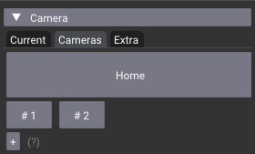

### Other modes 

Other navigation modes also exist, like fly, where the `w`, `a`, `s`, `d` keys also moves the camera. 

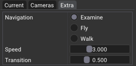


----
## Schema of the Program

The nvvk::Application is a class that provides a framework for creating Vulkan applications. It encapsulates the Vulkan instance, device, and surface creation, as well as window management and event handling.

When using `nvvk::Application`, you can attach `nvvkhl::IAppElement` to it and each element will be called for the different state, allowing to customize the behavior of your application. The `nvvkhl::IAppElement` class provides default implementations for these functions, so you only need to override the ones you need.

Here is a brief overview of how `nvvk::Application` works:

### Initialization:
When you create an instance of `nvvk::Application`, it sets up the Vulkan instance, device, and surface. It also creates a window and sets up event handling.

### Attaching Elements
In `main()` we are attaching many elements, like:
* `ElementCamera` : this allow to control a singleton camera
* `ElementProfiler` : allow to time the execution on the GPU
* `ElementBenchmarkParameters` : command line arguments and test purpose
* `ElementLogger` : redirect log information in a window
* `ElementNvml` : shows the status of the GPU

But the main one that interest us, and which is the main of this application is `GltfRendererElement`. This is the one that will be controlling the scene and rendering.


### Main Loop: 
The `nvvk::Application` class provides a main loop that continuously processes events and updates the application state. Inside the main loop, it calls the following functions:

* **onAttach()**:<br> 
This function is called whenever the element is attached to the application. In `GltfRendererElement`, we are creating the resource needed internally. 

* **onDetach()**: <br>
This function is called when the user tries to close the window. You can override this function to handle window close events.

* **onRender(VkCommandBuffer)**: <br>
This function is called to render the frame using the current command buffer of the frame. You can override this function to perform rendering operations using Vulkan. In `GltfRendererElement` this is where the active renderer is called.

* **onResize()**: <br>
This function is called when the `viewport` is resized. You can override this function to handle window resize events. In `GltfRendererElement` the G-Buffer will be re-created

* **onUIRender()**: <br>
This function is called to allow the `IAppElement` to render the UI and to query any mouse or keyboard event. In `GltfRendererElement`, we render the UI, but also the final image. The rendered image is consider a UI element, and that image covers the entire `viewport` ImGui window. 

* **onUIMenu()** <br>
Will be modifying what we see in the the window title. It will also create the menu, like `File`, `Help` and deal with some key combinations.

* **onFileDrop()** <br>
Will receive the path of the file been dropped on. If it is a .gltf, .glb or .hdr, it will load that file. 


----

## Scene Graph

The GLTF scene is loaded using tinygltf and then converted to a Vulkan version. The Vulkan version is a simplified version of the scene, where the geometry is stored in buffers, and the textures are uploaded to the GPU. The Vulkan version is used for both raster and ray tracing.

The scene is composed of nodes, where each node can have children and each node can have a mesh. The mesh is composed of primitives, where each primitive has a material. The material is composed of textures and parameters. However, none of this is directly used in the rendering, as we are using a simplified version of the scene.


Once the scene has been loaded, we proceed to parse it in order to collect the RenderNodes and RenderPrimitives. The RenderNode represents the flattened version of the tree of nodes, where the world transformation matrix and the material are stored. The RenderPrimitive, in contrast, represents the unique version of the primitive, where the index and vertex buffers are stored.

RenderNodes represent the elements to be rendered, while RenderPrimitives serve as references to the data utilized for rendering.

### Animation

If there is animation in the scene, a new section will appear under the Scene section.
It allows to play/pause, step and reset the animation, as well as changing its speed.


### Multiple Scene 

If there are multiple scenes,  a new section will appear under the Scene section.
It will show all the scenes and their name. Clicking on a scene name will switch to the scene.


### Material Variant

If there are multiple material variant, a new section will appear under the Scene section.
It will show all the material variant and their name. Clicking on a variant name will apply it on the models.


### Scene Graph UI

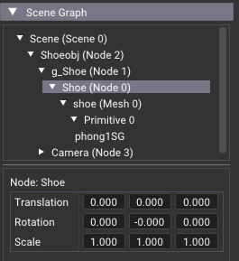

It is possible to visualize the scene hierarchy, to select node, to modify their transformation and their material, to some level.

