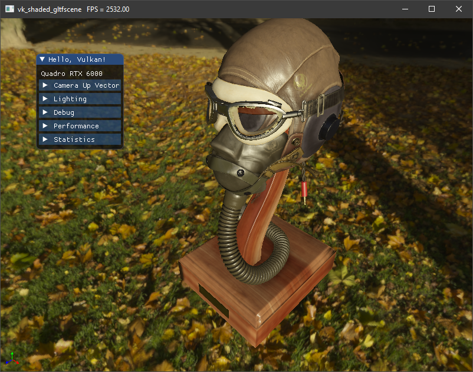

# VK_SCENE
 

Load a [glTF](https://www.khronos.org/gltf/) scene, with material and textures. Display a HDR image in the background and lit by this HDR. It renders in multiple passes, background, scene, then tonemap the result and add UI at the end. Shows how to deal with many objects, many materials and textures. This example will push the material parameters through `push_constant` and uses different descriptor sets to enable the textures to use. It also shows how to read the depth buffer to un-project the mouse coordinate to 3D position to set the camera interest.

Tags:
- GLTF, PBR material, HDR, tonemapper, textures, mipmapping, debugging shader, depth buffer reading, unproject, importance sampling, cubemap
