# Vulkan RTX Path Tracer — glTF Scene Editor & PBR Material Reference

[](LICENSE)
[](#requirements)
[](#build-and-run)
[](#requirements)

> Open-source **Vulkan RTX path tracer** and **PBR material reference** for **glTF 2.0** — with a built-in **glTF scene editor** for non-destructive hierarchy manipulation, material authoring, and save-back to glTF; AI denoising, and support for 36+ glTF extensions.

| Vulkan RTX Path Tracer & glTF Scene Editor |
|---|
| 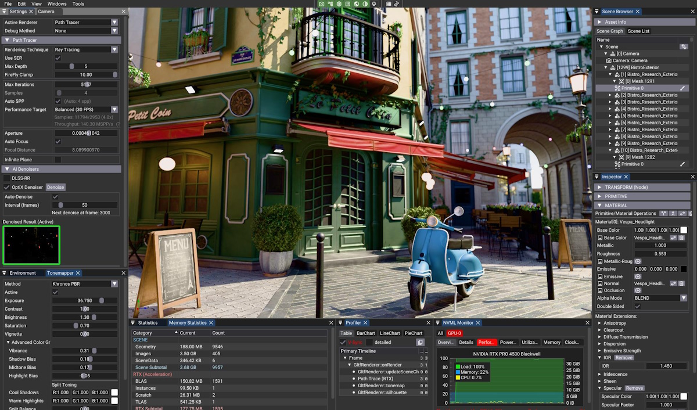 |

A production-quality **Vulkan ray tracing** renderer and **glTF PBR material reference** for **glTF 2.0** scenes. Comes with a built-in **glTF scene editor** — edit scene hierarchies, author PBR materials, apply transforms with a gizmo, and save back to glTF — backed by a high-fidelity **RTX path tracer** with **DLSS Ray Reconstruction** and **OptiX AI Denoiser**. Built for graphics developers who want a reference they can study, profile, and extend.

Built in C++ on [nvpro_core2](https://github.com/nvpro-samples/nvpro_core2) with [Slang](https://github.com/shader-slang/slang) shaders. Successor to [vk_raytrace](https://github.com/nvpro-samples/vk_raytrace).

## Highlights

- **glTF scene editor** — Non-destructive scene authoring: hierarchy manipulation, transform gizmo, node/material/light editing, undo/redo, and save back to glTF without touching the original assets.
- **glTF PBR material reference** — Monte Carlo path tracer with NEE, MIS, and adaptive sampling for physically accurate glTF PBR material evaluation.
- **35 glTF extensions** — Anisotropy, clearcoat, transmission, volume, sheen, iridescence, dispersion, retroreflection, Draco, interactivity, opacity micromaps, IES light profiles, and more.
- **glTF 2.1 complex scenes (preview)** — Compose multi-file scenes with External Assets: reference glTF/GLB files as instances that share geometry, with nested references, cycle detection, and file aliases — re-externalized on save.
- **AI denoising** — DLSS Ray Reconstruction and OptiX AI Denoiser produce clean images at interactive rates.
- **Agentic AI generation (optional)** — Local **ComfyUI** bridge that *beautifies* the current render or *generates an HDRI* environment from a text prompt.
- **Rasterizer preview** — Fast PBR rasterizer shares scene resources for instant iteration during editing.
- **Developer tools** — GPU profiler, memory tracker, shader hot-reload (Ctrl+Shift+R), headless batch mode.

## Quick Tour

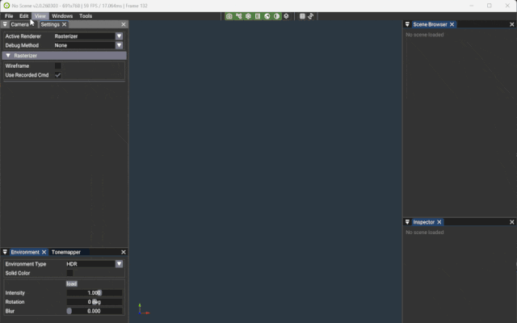

The demo shows a short end-to-end workflow: switching renderer modes, tuning settings, and inspecting scene content in the integrated editor.

## Build and Run

### Requirements

| Requirement | Minimum | Recommended |
|---|---|---|
| **OS** | Windows 10 / Linux | Windows 11 / Ubuntu 22.04+ |
| **GPU** | NVIDIA RTX 20-series (Turing) | NVIDIA RTX 40-series (Ada) |
| **Driver** | 535+ | Latest Game Ready / Studio |
| **CMake** | 3.22 | 3.28+ |
| **C++ Compiler** | C++20 (MSVC 2022 / GCC 12 / Clang 15) | MSVC 2022 17.8+ |
| **Vulkan SDK** | 1.4 | [Latest](https://vulkan.lunarg.com/sdk/home) |

### Quick start

```bash
# Clone (recommended: siblings; CMake auto-downloads nvpro_core2 if missing)
git clone https://github.com/nvpro-samples/nvpro_core2.git
git clone https://github.com/nvpro-samples/vk_gltf_renderer.git
cd vk_gltf_renderer
```

```bash
# Windows
cmake -B build -S . -G "Visual Studio 17 2022" -A x64
cmake --build build --config Release
.\_bin\Release\vk_gltf_renderer.exe
```

```bash
# Linux
cmake -B build -S . -G Ninja -DCMAKE_BUILD_TYPE=Release
cmake --build build
./_bin/Release/vk_gltf_renderer
```

### Common CMake options

| Option | Default | Description |
|---|---|---|
| `USE_DLSS` | `ON` | Enable DLSS Ray Reconstruction integration |
| `USE_OPTIX_DENOISER` | `ON` | Enable OptiX AI Denoiser (requires CUDA Toolkit) |
| `USE_DRACO` | `ON` | Enable Draco mesh compression support |
| `BUILD_TESTING` | `OFF` | Build unit tests and benchmarks |

## Features

- **Ray tracing**: High-quality path tracing reference for glTF PBR materials — Monte Carlo global illumination, next event estimation, multiple importance sampling, and adaptive sampling.
- Profiler, GPU monitor, GPU memory tracking, and statistics.
- Shader hot-reload (Ctrl+Shift+R) for developers who want to experiment.
- AI denoisers: DLSS Ray Reconstruction and OptiX AI Denoiser.
- Optional agentic AI generation via a local ComfyUI bridge: beautify the current render, or generate an HDRI environment from a text prompt (see [ComfyUI Agentic Setup](docs/comfyui-agentic-setup.md)).
- Rasterizer fallback for fast scene interaction and editing.
- A scene asset editor with hierarchy operations, a transform gizmo, material editing, merging, and saving back to glTF (non-destructive).
- glTF 2.1 complex-scene composition (preview): reference external glTF/GLB assets, instance them (shared geometry), resolve nested references with cycle detection, and re-externalize on save.
- Support for 36 glTF extensions, including anisotropy, clearcoat, transmission, volume, sheen, iridescence, dispersion, diffuse transmission, retroreflection, opacity micromaps, material variant, scattering, IES light profiles, and interactivity (behavior graphs).
- HDR environments, a physical sun and sky model, depth of field, and multiple tone mappers.
- Animation support includes skeletal, morph targets, and KHR_animation_pointer.
- GPU compute accelerates both skinning/morphing and per-level world-matrix propagation.

**More features** --> [User Guide](docs/user-guide.md)
 
## Showcase

| Feature | Preview |
|---|---|
| Showcase | 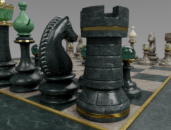 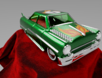 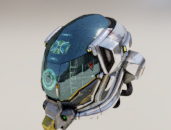 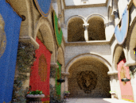 |
| Material features | 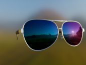 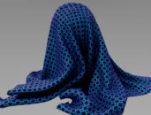 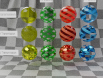 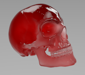 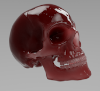 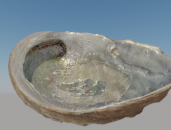 |
| Lighting and camera | 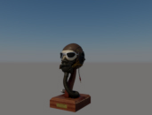 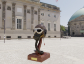  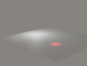 |

For a **full walkthrough** of rendering modes, editor workflows, and feature screenshots, see the [User Guide](docs/user-guide.md).

For **headless timing** and optional scripted GPU benchmarks, see [Benchmarking](docs/benchmarking.md) (`utils/benchmark/`).

To let an AI agent measure a shader change against the running renderer, launch with `--mcp` and
see [MCP shader timing](docs/mcp.md).

## Agentic — AI-Assisted Generation

Drive local generative AI from inside the renderer through an optional **[ComfyUI](https://www.comfy.org/)** bridge. Two tools are wired into the in-app **Agentic** window (press **F7**):

- **Beautify Last Render** — send the current path-traced frame to a diffusion model and get it back photorealistic, or restyled by prompt (pencil, cartoon, watercolor, blueprint, and more).
- **Generate HDRI From Prompt** — type a prompt and get a full 360° HDR environment, applied directly as the scene's lighting.

Generation is entirely optional — the renderer runs without it.

### Showcase

Path-traced renders (left), beautified or restyled by prompt (right):

| Original render | AI result |
| ---- | ---- |
|  | 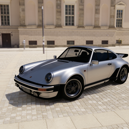 |
|  | 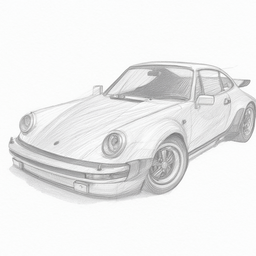 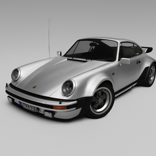 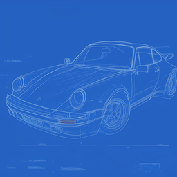 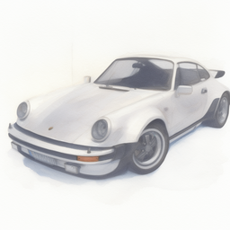 |
|  | 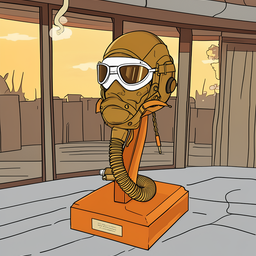 |

### Setup

Generation needs a local **ComfyUI** install, the diffusion models, and a small Python bridge that connects it to the renderer. The **[ComfyUI Agentic Setup](docs/comfyui-agentic-setup.md)** guide walks through it end to end:

1. Install ComfyUI and download the models.
2. Start ComfyUI.
3. Open the **Agentic** window (**F7**) and use **Copy start command** to launch the bridge in a terminal; once the **Bridge** and **ComfyUI** status lights are green, generate.

For the architecture, bridge directory layout, and request/response protocol behind it, see [Agentic Workflow](docs/agentic-workflow.md).

## glTF Support

**Reference scope:** The list below reflects what this renderer loads and displays. The **path tracer** is the authoritative PBR implementation — especially for ray-traced material evaluation, sampling, and new extensions (e.g. [KHR_materials_retroreflection](https://github.com/KhronosGroup/glTF/pull/2610)). The **rasterizer** is a preview path for interaction, not the primary material reference.

### Core

- ✅ glTF 2.0 (.gltf/.glb)
- ✅ Images (HDR, PNG, JPEG, KTX, KTX2, DDS, WebP)
- ✅ Buffers (geometry, animation, skinning)
- ✅ Textures and samplers
- ✅ Materials (PBR metallic-roughness and specular-glossiness)
- ✅ Animations (keyframe, skeletal)
- ✅ Skins
- ✅ Morph targets
- ✅ Cameras (perspective and orthographic)
- ✅ Punctual lights (directional, point, spot)
- ✅ Nodes and scene hierarchy
- ✅ Multiple scenes

### Extensions

- ✅ [KHR_accessor_float64](https://github.com/KhronosGroup/glTF/tree/main/extensions/2.0/Khronos/KHR_accessor_float64)
- ✅ [KHR_animation_pointer](https://github.com/KhronosGroup/glTF/tree/main/extensions/2.0/Khronos/KHR_animation_pointer)
- ✅ [KHR_draco_mesh_compression](https://github.com/KhronosGroup/glTF/tree/main/extensions/2.0/Khronos/KHR_draco_mesh_compression)
- ✅ [KHR_interactivity](https://github.com/KhronosGroup/glTF/tree/main/extensions/2.0/Khronos/KHR_interactivity)
- ✅ [KHR_lights_punctual](https://github.com/KhronosGroup/glTF/tree/main/extensions/2.0/Khronos/KHR_lights_punctual)
- ✅ [KHR_materials_anisotropy](https://github.com/KhronosGroup/glTF/tree/main/extensions/2.0/Khronos/KHR_materials_anisotropy)
- ✅ [KHR_materials_clearcoat](https://github.com/KhronosGroup/glTF/tree/main/extensions/2.0/Khronos/KHR_materials_clearcoat)
- ✅ [KHR_materials_diffuse_transmission](https://github.com/KhronosGroup/glTF/blob/main/extensions/2.0/Khronos/KHR_materials_diffuse_transmission/README.md)
- ✅ [KHR_materials_dispersion](https://github.com/KhronosGroup/glTF/tree/main/extensions/2.0/Khronos/KHR_materials_dispersion)
- ✅ [KHR_materials_emissive_strength](https://github.com/KhronosGroup/glTF/tree/main/extensions/2.0/Khronos/KHR_materials_emissive_strength)
- ✅ [KHR_materials_ior](https://github.com/KhronosGroup/glTF/tree/main/extensions/2.0/Khronos/KHR_materials_ior)
- ✅ [KHR_materials_iridescence](https://github.com/KhronosGroup/glTF/tree/main/extensions/2.0/Khronos/KHR_materials_iridescence)
- ✅ [KHR_materials_pbrSpecularGlossiness](https://github.com/KhronosGroup/glTF/tree/main/extensions/2.0/Archived/KHR_materials_pbrSpecularGlossiness)
- ✅ [KHR_materials_retroreflection](https://github.com/KhronosGroup/glTF/pull/2610)
- ✅ [KHR_materials_scatter](https://github.com/KhronosGroup/glTF/pull/2579)
- ✅ [KHR_materials_sheen](https://github.com/KhronosGroup/glTF/tree/main/extensions/2.0/Khronos/KHR_materials_sheen)
- ✅ [KHR_materials_specular](https://github.com/KhronosGroup/glTF/tree/main/extensions/2.0/Khronos/KHR_materials_specular)
- ✅ [KHR_materials_transmission](https://github.com/KhronosGroup/glTF/tree/main/extensions/2.0/Khronos/KHR_materials_transmission)
- ✅ [KHR_materials_unlit](https://github.com/KhronosGroup/glTF/tree/main/extensions/2.0/Khronos/KHR_materials_unlit)
- ✅ [KHR_materials_variants](https://github.com/KhronosGroup/glTF/tree/main/extensions/2.0/Khronos/KHR_materials_variants)
- ✅ [KHR_materials_volume](https://github.com/KhronosGroup/glTF/tree/main/extensions/2.0/Khronos/KHR_materials_volume)
- ✅ [KHR_mesh_quantization](https://github.com/KhronosGroup/glTF/tree/main/extensions/2.0/Khronos/KHR_mesh_quantization)
- ✅ [KHR_meshopt_compression](https://github.com/KhronosGroup/glTF/tree/main/extensions/2.0/Khronos/KHR_meshopt_compression)
- ✅ [KHR_node_hoverability](https://github.com/KhronosGroup/glTF/tree/main/extensions/2.0/Khronos/KHR_node_hoverability)
- ✅ [KHR_node_selectability](https://github.com/KhronosGroup/glTF/tree/main/extensions/2.0/Khronos/KHR_node_selectability)
- ✅ [KHR_node_visibility](https://github.com/KhronosGroup/glTF/tree/main/extensions/2.0/Khronos/KHR_node_visibility)
- ✅ [KHR_texture_basisu](https://github.com/KhronosGroup/glTF/tree/main/extensions/2.0/Khronos/KHR_texture_basisu)
- ✅ [KHR_texture_transform](https://github.com/KhronosGroup/glTF/tree/main/extensions/2.0/Khronos/KHR_texture_transform)
- ✅ [KHR_xmp_json_ld](https://github.com/KhronosGroup/glTF/tree/main/extensions/2.0/Khronos/KHR_xmp_json_ld)
- ✅ [EXT_lights_ies](https://github.com/KhronosGroup/glTF/tree/main/extensions/2.0/Vendor/EXT_lights_ies)
- ✅ [EXT_mesh_gpu_instancing](https://github.com/KhronosGroup/glTF/tree/main/extensions/2.0/Vendor/EXT_mesh_gpu_instancing)
- ✅ [EXT_mesh_opacity_micromap](https://github.com/pixeljetstream/glTF/tree/EXT_mesh_opacity_micromap/extensions/2.0/Vendor/EXT_mesh_opacity_micromap)
- ✅ [EXT_meshopt_compression](https://github.com/KhronosGroup/glTF/tree/main/extensions/2.0/Vendor/EXT_meshopt_compression)
- ✅ [EXT_texture_webp](https://github.com/KhronosGroup/glTF/tree/main/extensions/2.0/Vendor/EXT_texture_webp)
- ✅ [MSFT_texture_dds](https://github.com/KhronosGroup/glTF/tree/main/extensions/2.0/Vendor/MSFT_texture_dds)

### glTF 2.1 (Complex Scenes — preview)

Early support for the [glTF 2.1 complex-scene](https://www.khronos.org/blog/introducing-gltf-2.1-with-complex-scenes) composition features — the standardized successor to the earlier glTFX / External Reference proposals:

- ✅ External Assets — reference other glTF/GLB files from scene nodes (`node.externalAsset`) and instantiate them at load time
- ✅ Multiple instances of the same asset share geometry (meshes / BLAS)
- ✅ Nested external assets — recursive resolution with cycle detection
- ✅ Unified file references — top-level `files` array (external `uri`)
- ✅ File aliases — inner-URI redirection for shared or overridden resources
- ✅ Re-externalized on save (references preserved); "Make Editable" embeds an asset inline
- 🚧 Packaging — embedded external assets (`bufferView` / `data:` URI) not yet resolved
- 🚧 Shapes and scene-level bounding volumes

See [External Assets](docs/external_assets.md) for design details.

## Documentation

**For users**

- [User Guide](docs/user-guide.md) — renderer settings, PBR materials, scene editor, camera, environment, tone mapping, common CLI flags, and troubleshooting.
- [ComfyUI Agentic Setup](docs/comfyui-agentic-setup.md) — set up the local ComfyUI install, models, and bridge to beautify renders and generate HDRIs from prompts.
- [glTF Resources](docs/resources.md) — curated collection of glTF models, HDR environments, specifications, and tools.

**For contributors**

- [Developer Guide](docs/developer.md) — architecture overview, source map, material system, and testing.
- [Rendering Architecture](docs/RENDERING_ARCHITECTURE.md) — data flow from glTF model to GPU, BLAS/TLAS acceleration structures, and render nodes.
- [External Assets](docs/external_assets.md) — glTF 2.1 complex scenes: reference / merge / edit / save mechanics.
- [Agentic Workflow](docs/agentic-workflow.md) — architecture, filesystem bridge protocol, and roadmap behind the optional AI generation feature.
- [Benchmarking](docs/benchmarking.md) — headless timing and scripted GPU benchmarks.

These docs explain concepts and workflows and point at *where* things live; enumerated facts (extension lists, CLI flags, enum values) are owned by the code.

## License

[Apache License 2.0](LICENSE) - Copyright (c) 2023-2026, NVIDIA CORPORATION.
