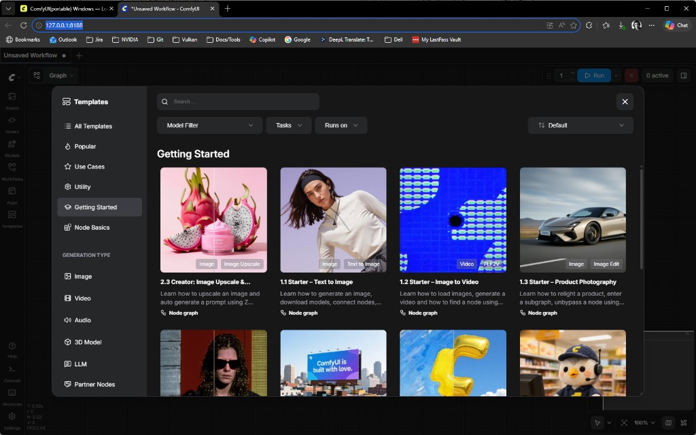

# ComfyUI for Agentic (HDRI + Beautify)

Optional local service for **Generate HDRI From Prompt** and **Beautify Last Render**. The renderer works fine without it.

## Overview

You run **three** things:

1. **ComfyUI** — the image generator.
2. The **bridge** — a small Python helper that connects the renderer to ComfyUI.
3. The **renderer** itself.

Open the renderer's **Agentic** window (F7): two lights show whether the **Bridge** and **ComfyUI** are up, and generation enables once both are green. The window also has a **Copy start command** button and a link back to this guide.

Quick path: install ComfyUI + models (§2) → start ComfyUI → start the bridge (§3) → generate. Read on for the details.

Adjust paths if your install differs:

| | Default |
|---|---------|
| ComfyUI | `D:\tools\ComfyUI_windows_portable` |
| Repo | `D:\src\nvpro-samples\vk_gltf_renderer` |
| Bridge | `_bin\Release\agentic_bridge` (or `_bin\Debug\agentic_bridge`) |
| ComfyUI URL | `http://127.0.0.1:8188` |
| Python (PNG→HDR) | `D:\tools\ComfyUI_windows_portable\python_embeded\python.exe` |

---

## 1. Install ComfyUI

1. [ComfyUI portable (Windows, NVIDIA)](https://docs.comfy.org/installation/comfyui_portable_windows) → extract so `run_nvidia_gpu.bat` exists.
2. Run `update\update_comfyui_and_python_dependencies.bat` once.
3. Start `run_nvidia_gpu.bat` — browser should open `http://127.0.0.1:8188`. Leave ComfyUI running.



Create under `ComfyUI\models\` if missing: `diffusion_models\`, `text_encoders\`, `vae\` — the three folders the workflow loaders read from.

---

## 2. Download models

**Filenames and folders must match exactly** or loaders show `Value not in list`.

> **These are large downloads.** The HDRI (Flux) set alone is roughly **35 GB** (`flux1-dev` ~24 GB, `t5xxl_fp16` ~10 GB); the Beautify set adds several GB more, and the optional 4× upscale models a few GB on top. Sizes are approximate — check each source page. Plan disk space and download time accordingly.

### Beautify (always)

| File | Folder |
|------|--------|
| `flux-2-klein-base-4b-fp8.safetensors` | `diffusion_models\` |
| `qwen_3_4b.safetensors` | `text_encoders\` |
| `flux2-vae.safetensors` | `vae\` |

- [flux-2-klein-base-4b-fp8](https://huggingface.co/black-forest-labs/FLUX.2-klein-base-4b-fp8/resolve/main/flux-2-klein-base-4b-fp8.safetensors)
- [qwen_3_4b](https://huggingface.co/Comfy-Org/z_image_turbo/resolve/main/split_files/text_encoders/qwen_3_4b.safetensors)
- [flux2-vae](https://huggingface.co/Comfy-Org/flux2-dev/resolve/main/split_files/vae/flux2-vae.safetensors)

### HDRI (Flux)

| File | Folder |
|------|--------|
| `flux1-dev.safetensors` | `diffusion_models\` |
| `ae.safetensors` | `vae\` |
| `clip_l.safetensors` | `text_encoders\` |
| `t5xxl_fp16.safetensors` | `text_encoders\` |

Direct downloads (paths match [ComfyUI Flux examples](https://github.com/comfyanonymous/ComfyUI_examples/blob/master/flux/README.md)):

- [flux1-dev](https://huggingface.co/Comfy-Org/flux1-dev/resolve/main/flux1-dev.safetensors) → `diffusion_models\` ([Comfy-Org/flux1-dev](https://huggingface.co/Comfy-Org/flux1-dev), repo root — not under `split_files/`)
- [ae](https://huggingface.co/Comfy-Org/Lumina_Image_2.0_Repackaged/resolve/main/split_files/vae/ae.safetensors) → `vae\`
- [clip_l](https://huggingface.co/comfyanonymous/flux_text_encoders/resolve/main/clip_l.safetensors) → `text_encoders\`
- [t5xxl_fp16](https://huggingface.co/comfyanonymous/flux_text_encoders/resolve/main/t5xxl_fp16.safetensors) → `text_encoders\`

Alternative for `flux1-dev.safetensors`: [black-forest-labs/FLUX.1-dev](https://huggingface.co/black-forest-labs/FLUX.1-dev) (requires Hugging Face login + license acceptance; use ComfyUI model manager if the browser download fails).

**Only if you enable “High-res 4× upscale” in the Agentic window** (off by default) — also add:

| File | Folder |
|------|--------|
| `pid_flux1_1024_to_4096_4step_bf16.safetensors` | `diffusion_models\` |
| `gemma_2_2b_it_elm_bf16.safetensors` | `text_encoders\` |

- [pid_flux1_1024_to_4096_4step_bf16](https://huggingface.co/Comfy-Org/PixelDiT/resolve/main/diffusion_models/pid_flux1_1024_to_4096_4step_bf16.safetensors)
- [gemma_2_2b_it_elm_bf16](https://huggingface.co/Comfy-Org/PixelDiT/resolve/main/text_encoders/gemma_2_2b_it_elm_bf16.safetensors)

(`pixel_space` VAE is provided by ComfyUI — no extra download.)

Press **R** in ComfyUI (or restart) after adding files.

---

## 3. Run everything

You need **three** processes:

| # | What | How |
|---|------|-----|
| A | ComfyUI | `run_nvidia_gpu.bat` |
| B | Renderer | `vk_gltf_renderer.exe` → **Agentic** window (F7). It shows two lights, **Bridge** and **ComfyUI**; generation enables once both are green. (Bridge folder / polling live under **Advanced**.) |
| C | Adapter | Second terminal (command below) |

**Start the adapter (step C).** In the **Agentic** window (F7), click **Copy start command** — it fills in *your* paths — then paste and run it in a second terminal. Prefer this over typing paths by hand.

Only if that button is unavailable, adapt the template below: replace every `D:\…` path with yours, and match your build (`_bin\Release` or `_bin\Debug`).

```bat
cd /d D:\src\nvpro-samples\vk_gltf_renderer
python utils\comfy_bridge\comfy_bridge.py ^
  --bridge-root _bin\Release\agentic_bridge ^
  --workflow-dir utils\comfy_bridge\workflows ^
  --comfy-url http://127.0.0.1:8188 ^
  --converter-python "D:\tools\ComfyUI_windows_portable\python_embeded\python.exe"
```

Status dot: **green** = adapter OK, **red** = start step C.

Workflow JSON is copied next to the exe on build (`utils\comfy_bridge\workflows\`).

### Verify before you generate

Confirm each piece before the first (slow) generation:

| Check | How |
|-------|-----|
| ComfyUI up | Browser opens `http://127.0.0.1:8188`, or `curl http://127.0.0.1:8188/system_stats` returns JSON |
| Models in place | Every file from §2 sits in the exact folder (`diffusion_models\` / `text_encoders\` / `vae\`); press **R** in ComfyUI after adding files |
| Adapter running | The second terminal shows `comfy_bridge.py` polling, with no traceback |
| Both lights green | **Bridge** and **ComfyUI** in the **Agentic** window (F7) are green — generation enables only then |

Any red? See [Troubleshooting](#troubleshooting).

---

## 4. Use it

### HDRI

1. Edit the HDRI prompt (multiline box).
2. **High-res 4× upscale** — both output 4096×2048 (1024×512 generation, 4× upscale). Off by default → `hdri_from_prompt.json`, bicubic upscale (no extra models). On → `hdri_from_prompt_4x.json`, model-based PixelDiT upscale (needs the extra models above).
3. **Steps/seed** apply to both HDRI and Beautify.
4. **Generate HDRI from prompt** (enabled once the adapter dot is green) → progress bar while ComfyUI runs → status **HDRI applied** → `agentic_bridge\assets\<job_id>.hdr`.

### Beautify

1. Render a scene in the viewport.
2. Edit the Beautify prompt; set steps/seed if needed.
3. **Beautify last render** (enabled once the adapter dot is green) → **Beautified output displayed** → `assets\<job_id>_beautified.png` (same size as the viewport capture).

---

## Troubleshooting

| Problem | Check |
|---------|--------|
| `Value not in list` | Model name/path in §2 |
| Red adapter dot | Adapter command (§3C) running |
| Comfy not reachable | ComfyUI on `127.0.0.1:8188` |
| HDRI / `png_to_hdr` / `PIL` | `--converter-python` = Comfy portable `python.exe` |
| Job failed | `agentic_bridge\responses\<job_id>.json` → `message` |
| Stuck on “Waiting” | Adapter must run `comfy_bridge.py`; live progress is `.job_progress\<job_id>.json` |

```bat
curl http://127.0.0.1:8188/system_stats
dir _bin\Release\agentic_bridge\responses
```

Keep ComfyUI on localhost only — do not expose with `--listen` on untrusted networks.


## Prompts

Ready-made prompts for both HDRI and Beautify ship in `utils/comfy_bridge/prompts.json` (copied next to the executable). They appear in the **Presets** dropdown in each prompt box of the Agentic window — pick one, then edit it freely. Beautify presets include photorealistic plus stylized looks (pencil sketch, blueprint, cartoon, watercolor, clay); HDRI presets cover a few times of day and settings.

To customize, edit that file (add entries under `hdri` / `beautify` as `{ "name": …, "prompt": … }`; they load at startup), or drop a copy at `<bridge>/prompts.json` to override per project. The first `beautify` entry mirrors the app's built-in default.

Tip: the beautifier runs Flux.2 Klein at CFG 1 (the distilled model's intended value); higher CFG over-saturates toward the CGI look. Avoid particle words like "dust" — Flux may render them as floating flakes.
