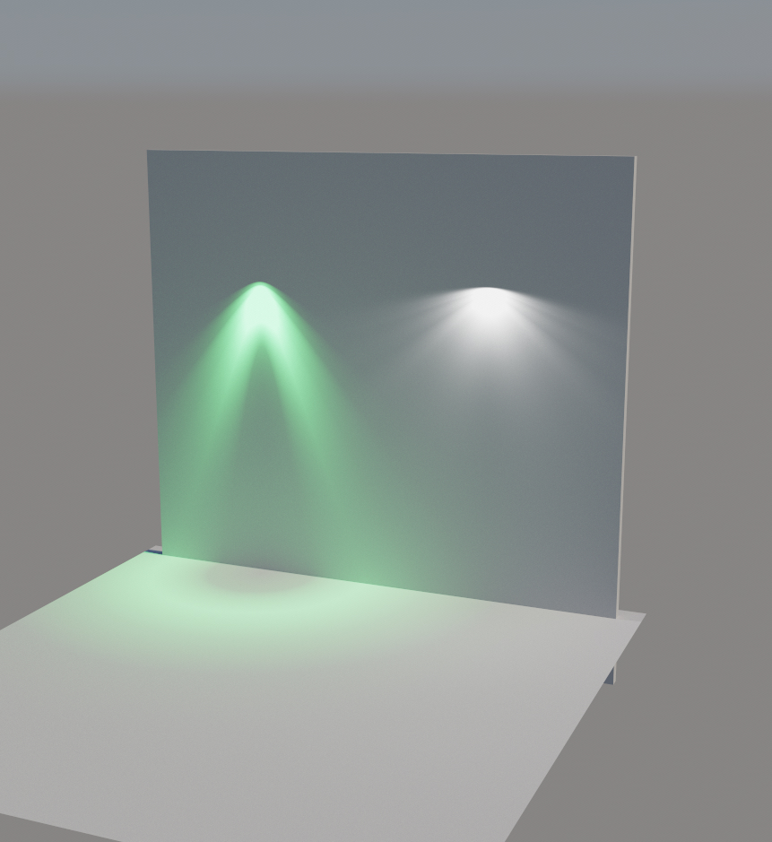

# Developer Guide -- Vulkan Ray Tracing glTF Renderer

> **For contributors and agents.** High-level architecture, source map, and the material system — concepts plus pointers into `src/` and `shaders/`, not a restatement of the code. For runtime usage see the [User Guide](user-guide.md); for the scene data-flow deep dive see [Rendering Architecture](RENDERING_ARCHITECTURE.md).

This project is developer-oriented: the **RTX path tracer** is the primary high-quality reference for ray tracing glTF PBR materials, while the **rasterizer** is a practical fallback for fast interaction and iteration. Both renderers share Vulkan resources and Slang shaders.

## Quick Navigation

- [Architecture](#architecture)
- [Scene Graph](#scene-graph)
- [Source Code Structure](#source-code-structure)
- [Material System](#material-system)
- [Agentic Workflow Bridge](#agentic-workflow-bridge)
- [Common Development Workflows](#common-development-workflows)
- [Testing](#testing)
- [Contributing](#contributing)

For the internal data-flow walkthrough (Model -> RenderNodes -> GPU/TLAS), including how ray tracing acceleration structures are built, see [Rendering Architecture](RENDERING_ARCHITECTURE.md).

For how glTF 2.1 external assets (complex scenes) are merged, flagged read-only, and re-externalized/flattened on save, see [External Assets](external_assets.md).

---

## Architecture

### Application Framework

`nvapp::Application` provides the Vulkan application lifecycle. You attach `nvapp::IAppElement` instances, and each is called for different states:

| Callback | Purpose |
|---|---|
| `onAttach()` | Create Vulkan resources, compile shaders, set up descriptor sets |
| `onDetach()` | Clean up all GPU resources |
| `onRender(cmd)` | Record rendering commands (dispatch to path tracer or rasterizer, then tone map) |
| `onResize()` | Recreate G-Buffer and notify renderers |
| `onUIRender()` | Render ImGui UI and handle input |
| `onUIMenu()` | Create menu bar (File, View, Tools, Debug) |
| `onFileDrop()` | Load dropped .gltf/.glb/.obj (or a `.scene.json` descriptor) as scenes, .hdr as environment maps |

In `main()` we attach:
- `GltfRenderer` — the main element (scene loading, rendering, UI)
- `ElementProfiler` — GPU execution timing
- `ElementLogger` — log output in a UI window
- `ElementGpuMonitor` — NVML-based GPU status monitoring
- `ElementDbgPrintf` — shader `printf` debug output (only when built with `USE_DBG_PRINTF`)

---

## Scene Graph

The glTF scene is loaded via TinyGLTF and converted to a GPU-friendly representation shared by both renderers.

````mermaid
---
config:
  layout: elk
  theme: neutral
---
flowchart TB
 subgraph RenderNodes["RenderNodes"]
        rn0["rn0"]
        rn1["rn1"]
        rn2["rn2"]
        rn3["rn3"]
        rn4["rn4"]
  end
 subgraph s1["RenderPrimitives"]
        n1["rp0"]
        n2["rp1"]
  end
 subgraph s2["RenderMaterials"]
        n3["m1"]
        n4["m2"]
        n5["m3"]
  end
    sceneRoot["sceneRoot"] --> node0["node0"]
    node0 --> node1["node1"] & node2["node2"] & node3["node3"]
    node3 --> mesh1["mesh1"]
    mesh0["mesh0"] --> prim0["prim0"] & prim1["prim1"]
    mesh1 --> prim2["prim1'"]
    node1 --> mesh0
    node2 --> mesh0
    prim0 --> rn0 & rn2 & n1 & n3
    prim1 --> rn1 & rn3 & n2 & n4
    prim2 --> rn4 & n2 & n5

    style node0 fill:#BBDEFB
    style node1 fill:#BBDEFB
    style node2 fill:#BBDEFB
    style node3 fill:#BBDEFB
    style prim0 fill:#C8E6C9
    style prim1 fill:#C8E6C9
    style prim2 fill:#C8E6C9
    style RenderNodes fill:#BBDEFB
    style s1 fill:#C8E6C9
    style s2 fill:#E1BEE7
````

**RenderNodes** are the flattened instances with world matrices and material references. **RenderPrimitives** are the unique geometry (vertex/index buffers). Shared primitives create one BLAS for multiple render nodes.

> RN0 == node0 -> node1 -> prim0
> RN1 == node0 -> node1 -> prim1
> RN2 == node0 -> node2 -> prim0
> RN3 == node0 -> node2 -> prim1
> RN4 == node0 -> node3 -> prim1'

---

## Source Code Structure

Primary files grouped by subsystem (not an exhaustive listing — treat `src/` and
`shaders/` as the source of truth for the complete set):

```text
src/
├── main.cpp                    # Entry point, Vulkan context, CLI parsing
├── renderer.cpp/hpp            # Main renderer orchestrator (GltfRenderer)
├── renderer_base.hpp           # BaseRenderer: abstract base for PathTracer / Rasterizer
├── renderer_pathtracer.cpp/hpp # Monte Carlo path tracer (Vulkan ray tracing + ray query)
├── renderer_rasterizer.cpp/hpp # Forward PBR rasterizer
├── renderer_silhouette.cpp/hpp # Selection highlight (compute shader)
├── mcp_timing.cpp/hpp          # Optional MCP endpoint (--mcp): recompile shaders, time a
│                               #   GPU pass over a window (docs/mcp.md)
├── hover_picker.cpp/hpp        # Async G-buffer readback for KHR_interactivity hover detection
├── settings_registry.hpp       # One declaration per setting -> CLI + benchmark sequences + ImGui.ini;
│                               #   also captures each declaration-time default (Reset All to Default)
├── resources.hpp               # Shared Vulkan resources and settings (`nvvk::FrameUploader` staging)
│
├── gltf_scene.cpp/hpp          # Core scene loading and management
├── gltf_scene_vk.cpp/hpp       # GPU buffer/texture upload (SceneVk)
├── gltf_scene_omm.cpp/hpp      # Opacity micromaps (SceneOmm), EXT_mesh_opacity_micromap → VK_EXT_opacity_micromap
├── gltf_scene_rtx.cpp/hpp      # BLAS/TLAS acceleration structures (SceneRtx)
├── gltf_scene_gpu.cpp/hpp      # SceneGpu — coordinates SceneVk / AnimationVk / SceneRtx / TransformComputeVk
├── gltf_scene_editor.cpp/hpp   # Scene editing (add/delete/duplicate nodes)
├── gltf_scene_animation.cpp/hpp# AnimationSystem: playback/interpolation (CPU), via Scene::animation()
├── gltf_scene_animation_vk.cpp/hpp # GPU compute skinning / morph target animation
├── gltf_scene_transform_vk.cpp/hpp # GPU compute world-matrix propagation
├── gltf_scene_merger.cpp/hpp   # Merge two glTF scenes
├── gltf_scene_validator.cpp/hpp# Scene validation
├── gltf_compact_*.cpp/hpp      # Orphan resource removal / buffer compaction
├── gltf_create_tangent.cpp/hpp # Tangent space generation (UV gradient + MikkTSpace)
├── gltf_material_cache.cpp/hpp # CPU-side material cache
├── gltf_image_loader.cpp/hpp   # Image decoding (DDS, KTX, STB, WebP)
├── gltf_animation_pointer.*    # KHR_animation_pointer support
├── ies_profile.cpp/hpp         # EXT_lights_ies: IESNA LM-63 photometric profile parser
│
├── ui_inspector.cpp/hpp        # Property inspector (per selection type: node/primitive/material/
│                               #   mesh/camera/light/texture/image/sampler/animation)
├── ui_scene_browser.cpp/hpp    # Scene Browser window: Scene Graph tree + the Elements tab host
├── ui_scene_browser_elements.cpp # Elements tab: builds the ElementTypeDesc registry and the one
│                               #   generic list renderer (icon tabs, columns, toolbar, sort, filter)
├── ui_element_registry.hpp     # ElementTypeDesc / ElementColumn / ElementAddVariant (data-driven list)
├── ui_gltf_labels.cpp/hpp      # Shared image-name + sampler wrap/filter labels (list + inspector)
├── ui_renderer.cpp             # Viewport UI and mouse interaction
├── ui_dock_layout.cpp/hpp      # Default docking arrangement, shared by start-up (main.cpp's
│                               #   dockSetup) and Windows > Reset UI Layout
├── ui_xmp.cpp/hpp              # KHR_xmp_json_ld metadata display
├── ui_animation.cpp/hpp        # Animation playback state and viewport animation widget
├── ui_mouse_state.hpp          # Mouse state tracking for viewport
├── ui_busy_window.hpp          # Loading/busy indicator overlay
│
├── dlss.cpp/hpp                # DLSS adapter (Ray Reconstruction + Super Resolution)
├── dlss_wrapper.cpp/hpp        # NGX / DLSS SDK wrapper (project-independent)
├── optix_denoiser.cpp/hpp      # OptiX AI Denoiser integration
├── vk_cuda.cpp/hpp             # Vulkan-CUDA interop (shared memory/semaphores)
│
├── gizmo_transform_vk.cpp/hpp  # 3D translate/rotate/scale gizmo
├── gizmo_grid_vk.cpp/hpp       # Infinite procedural grid
├── gizmo_visuals_vk.cpp/hpp    # Helper overlay manager
│
├── undo_redo.cpp/hpp           # Full undo/redo system for scene editing
├── tinygltf_utils.cpp/hpp      # TinyGLTF material + node extension extraction (visibility/selectability/hoverability)
├── tinygltf_converter.cpp/hpp  # OBJ to glTF converter
├── tiny_stb_implementation.cpp # STB library implementation (single compilation unit)
├── pipeline_cache_util.cpp/hpp # Vulkan pipeline cache persistence
├── scene_selection.cpp/hpp     # Selection state and events
├── scene_descriptor.cpp/hpp    # Scene descriptor set layout / bindings
├── scene_feature_detection.cpp/hpp # Detect which extensions a scene uses
├── scene_shader_macros.cpp/hpp # Emit -DGLTF_USE_* macros from detected features
├── timeline_pipeline.cpp/hpp   # Timeline-semaphore submission helper
├── benchmarking.cpp/hpp        # Headless timing / scripted GPU benchmarks
├── gltf_camera_utils.hpp       # Camera utility functions
├── gpu_memory_tracker.hpp      # GPU memory category tracking
├── scoped_banner.hpp           # Scoped UI banner helper
└── utils.hpp                   # Miscellaneous utilities

shaders/
├── gltf_pathtrace.slang        # Path tracer (compute + ray generation)
├── gltf_raster.slang           # PBR rasterizer (vertex + fragment)
├── silhouette.comp.slang       # Selection edge detection
├── skinning.comp.slang         # GPU skinning
├── morph.comp.slang            # GPU morph-target blending
├── world_matrix_propagate.comp.slang   # Per-level world-matrix propagation
├── snapshot_prev_transforms.comp.slang # Snapshot previous transforms (motion vectors)
├── update_render_instances.comp.slang  # Refresh render-instance data on GPU
├── animation_io.h.slang        # Skinning/morph shader I/O
├── world_matrix_io.h.slang     # World-matrix compute shader I/O
├── shaderio.h                  # Host/device shared structures
├── pathtrace_functions.h.slang # Path-tracer hit/shading helpers (getShadowTransmission, etc.)
├── common.h.slang              # Shared shader utilities
├── get_hit.h.slang             # Hit state interpolation
├── raytracer_interface.h.slang # RayQuery vs traditional RT abstraction
├── dlss_util.h                 # DLSS motion vector / guide buffer utilities
├── gizmo_grid.slang            # Infinite grid rendering
├── gizmo_grid_shaderio.h.slang # Grid shader I/O
├── gizmo_visuals.slang         # Transform gizmo overlays
├── gizmo_visuals_shaderio.h.slang # Gizmo shader I/O
├── optix_image_to_buffer.slang # OptiX denoiser buffer conversion
├── gltf_light_ies.h.slang      # EXT_lights_ies: photometric-profile falloff lookup
│
│   # Local material fork (see "Material System" below)
├── gltf_material_config.h      # MAT_EXT_* compile-time feature flags
├── gltf_eval_config.h          # GLTF_USE_* runtime behavior gates
├── gltf_scene_io.h.slang       # GltfShadeMaterial / GltfLight / GltfScene shaderio structs
├── gltf_vertex_access.h.slang  # Vertex buffer accessors
└── gltf_material_eval.h.slang  # evaluateMaterial(): GltfShadeMaterial -> PbrMaterial
```

---

## Material System

The glTF material struct (`shaderio::GltfShadeMaterial`) and its `evaluateMaterial()` function
are **forked locally** into `shaders/gltf_*.h.slang` rather than using the upstream
`nvpro_core2/nvshaders/` versions. The fork exists for two reasons:

1. **Forkability**: the struct layout can be tailored to this project without affecting other
   samples that share `nvpro_core2`.
2. **Extension gating**: every `KHR_materials_*` extension (plus `KHR_texture_transform`) is
   controlled by a compile-time `MAT_EXT_*` flag in
   [`shaders/gltf_material_config.h`](../shaders/gltf_material_config.h).
   When a flag is `0`, that extension's fields drop out of the relevant struct
   (`GltfShadeMaterial` for `KHR_materials_*`, `GltfTextureInfo` for `KHR_texture_transform`)
   and its code paths drop out of `evaluateMaterial()` / `getTexture()` / `getShadowTransmission()`.
   Defaults are all `1`, reproducing the upstream behavior byte-for-byte.
3. **Behavior gating (runtime-safe)**: `GLTF_USE_*` in
   [`shaders/gltf_eval_config.h`](../shaders/gltf_eval_config.h) gates material eval, path-tracer
   state (`PathTracerState`, volume segment, shadow transmission), and raster extension paths
   without changing buffer layout. Optimal mode passes each gate as `-DGLTF_USE_X=0` or `1`
   from `SceneFeatureSet` (never `-DMAT_EXT_X=0` at runtime). `MAT_EXT_*` remains layout authority
   on host and device only.

### Key design points

- **`gltf_scene_io.h.slang`** and **`gltf_vertex_access.h.slang`** intentionally reuse the
  upstream include guards (`DH_SCN_DESC_H`, `VERTEX_ACCESSORS_H`) so that transitive
  includes from `nvpro_core2` headers (e.g. `nvshaders/light_contrib.h.slang`) become
  no-ops. The local version must be included first in every translation unit.
- **`gltf_material_eval.h.slang`** uses its own guard (`GLTF_MATERIAL_EVAL_H`) because no
  upstream code transitively includes it.
- `PbrMaterial` and the BSDF interface (`nvshaders/bsdf_functions.h.slang`) stay in
  `nvpro_core2`. The local `evaluateMaterial()` initializes `PbrMaterial` with
  `defaultPbrMaterial()` first, then overrides per extension — gating an extension off
  safely leaves the corresponding BSDF fields at their neutral defaults.
- Struct members carry their defaults inline, so `GltfShadeMaterial m = {};` works; no
  parallel `default*()` helpers to keep in sync (see `shaders/gltf_scene_io.h.slang`).
- Host-side layout is guarded by `static_assert`s in
  [`src/gltf_material_cache.cpp`](../src/gltf_material_cache.cpp) (8-byte
  alignment/stride plus anchor offsets), so flipping any `MAT_EXT_*` flag that breaks the
  layout fails the build immediately.
- Retroreflection is a worked example of the pattern: `MAT_EXT_RETROREFLECTION` gates
  `KHR_materials_retroreflection` on both host and device, with the evaluation living in
  [`gltf_material_eval.h.slang`](../shaders/gltf_material_eval.h.slang). See the
  [KHR_materials_retroreflection](https://github.com/KhronosGroup/glTF/blob/main/extensions/2.0/Khronos/KHR_materials_retroreflection/README.md) specification.

### Texture channels: KTX2 swizzle and two-channel sources

Container formats can store fewer channels than the shader expects, in two different ways, and the
renderer resolves both on the host so the shader stays simple.

- **Authored swizzle.** A KTX2 file may carry a `KTXswizzle` key (e.g. a BC5 metallic-roughness map
  that declares `1rg1`). `nv_ktx` parses it into `KTXImage::swizzle`;
  [`gltf_image_loader.cpp`](../src/gltf_image_loader.cpp) converts it to a `VkComponentMapping`, and
  `SceneVk::createImage()` applies it to the `VkImageView` — so the swizzle costs nothing at sample
  time and both render paths see the remapped channels. The same field is used to expand
  single-channel `stb_image` results to grayscale.
- **Missing channels.** A two-channel format (BC5, `R8G8`, EAC_R11G11) has no third channel to
  swizzle from; Vulkan samples blue as a synthetic `0`. That is fine for data that only occupies two
  channels, but it breaks tangent-space normal maps, whose Z is implied rather than stored — decoding
  the synthetic `0` to `-1` flips the normal into the surface and the surface renders black.
  `SceneVk::buildTextureFormatFlags()` infers the component count from the decoded `VkFormat` and
  marks the **exactly two-channel** ones in `GltfTextureInfo::flags`; `decodeTangentSpaceNormal()` in
  [`gltf_material_eval.h.slang`](../shaders/gltf_material_eval.h.slang) rebuilds Z from the
  unit-length assumption. Three-channel maps keep their authored Z, and single-channel formats are
  excluded — their green is synthetic too, so there is no second axis to reconstruct from.

Because the flag depends on the decoded image format, texture creation runs **before**
`uploadMaterials()` in `SceneVk::create()` and `recreatePreservingTextures()` — the material cache
bakes the per-texture sampler slot and format flags (`TextureSlotTable`) into `GltfTextureInfo`.

### Worked example: `KHR_materials_scatter` (two modes, one material block)

`KHR_materials_scatter` is the most involved extension in the fork because it changes either the
surface BSDF or the volume transport, depending on the material. Both branches live in the scatter
block of [`gltf_material_eval.h.slang`](../shaders/gltf_material_eval.h.slang); the mode is
selected by `PbrMaterial::thickness` (i.e. by `KHR_materials_volume`), matching the extension spec.

- **Thin-walled** (no volume, or thickness 0). The spec turns the transmissive part of the
  dielectric base into a blend of the specular BTDF and a Lambertian BSDF that splits its energy
  between the two hemispheres by the scatter anisotropy. There is no dedicated scatter lobe in
  `nvpro_core2`'s BSDF, so the block re-expresses that blend with the lobes that already exist. It
  moves `transmission * scatterStrength` out of the specular BTDF into the diffuse bucket, then
  splits that bucket with `diffuseTransmissionFactor`. Note what the factor is: the forward share
  **of the whole diffuse bucket**, not the anisotropy's forward fraction — the bucket also holds
  the untouched diffuse base, so the fraction has to be normalised by the bucket's own weight.
  Conflating the two is what makes the mapping wrong for `transmissionFactor < 1`, and it is only
  by coincidence correct at `transmissionFactor = 1`. Done that way the lobe weights match the
  spec exactly for any transmission, strength and anisotropy. The spec also gives the residual
  specular BTDF and the diffuse reflection lobe *different* colors, and `PbrMaterial::baseColor`
  alone can only carry one — hence `PbrMaterial::transmissionTint` in `nvpro_core2`, a
  multiplier on the BTDF lobe that is `float3(1)` for every other material.
- **Volumetric** (thickness > 0). The surface BSDF is untouched; the block only derives
  `PbrMaterial::scatterCoefficient` (σs) by splitting the `KHR_materials_volume` extinction with
  the Kulla-Conty single-scatter albedo. The transport that consumes it is
  `handleVolumeScatter()` in [`pathtrace_functions.h.slang`](../shaders/pathtrace_functions.h.slang).

Two things about the volume transport are worth knowing before touching it:

- glTF media are **homogeneous**, so the free-flight distance is sampled analytically per spectral
  channel and combined with the balance heuristic — not with delta tracking against a majorant.
  A single majorant makes the low-extinction channels collide (and therefore random-walk) far too
  often; because those extra collisions are lossless, their effective per-collision albedo drifts
  towards 1 and the medium's perceived color shifts away from `multiscatterColor`.
- `VolumeMedium` stores **absorption**, not extinction, alongside the scattering coefficient. The
  fields are half floats, and a medium authored near white has σa as a tiny difference of two
  large numbers — recovering it by subtraction quantizes the albedo straight to 1.
- In-volume Russian roulette has its **own** probability cap (`RR_PCONT_CAP_VOLUME`). A dense,
  high-albedo medium keeps the throughput near 1, so the surface cap would cull fully energetic
  paths at every scatter event and the medium would render far too dark. The cap must stay below
  1 all the same: without roulette such a path never terminates.
- Surfaces with a diffuse transmission lobe are lit from **both** hemispheres, so `sampleLights()`
  takes a flag that disables the punctual-light hemisphere rejection in
  `singleLightContribution()`. Without it, a light behind a backlit leaf or sheet contributes
  nothing.

The rasterizer cannot trace inside a medium, so `evaluateMaterial()` compiles only the thin-walled
branch for `RASTER_PIPELINE` — the approximation the scatter spec explicitly permits for renderers
without volumetric transport.

### Adding a new KHR_materials_* extension

1. Define a new `MAT_EXT_<NAME>` flag in [`gltf_material_config.h`](../shaders/gltf_material_config.h),
   default `1`.
2. In [`gltf_scene_io.h.slang`](../shaders/gltf_scene_io.h.slang), add the new struct fields
   (+ any texture slots) inside `#if MAT_EXT_<NAME>` with inline default values.
3. Add `GLTF_USE_<NAME>` in [`gltf_eval_config.h`](../shaders/gltf_eval_config.h) (default
   `MAT_EXT_<NAME>`) and the matching `#error` guard.
4. In [`gltf_material_eval.h.slang`](../shaders/gltf_material_eval.h.slang), add the evaluation
   block inside `#if GLTF_USE_<NAME>`, overriding the relevant `PbrMaterial` fields. Respect
   the existing block order (volume block runs before IOR, etc.).
5. In [`src/gltf_material_cache.cpp`](../src/gltf_material_cache.cpp), add the matching CPU-side
   population block under `#if MAT_EXT_<NAME>` — layout only; never toggle `MAT_EXT_*` at runtime.
6. In [`src/scene_feature_detection.cpp`](../src/scene_feature_detection.cpp) and
   [`src/scene_shader_macros.cpp`](../src/scene_shader_macros.cpp), detect scene usage and emit
   `-DGLTF_USE_<NAME>=0|1` in optimal mode.
7. If the path tracer or raster reads the new field outside `evaluateMaterial()` (e.g.
   `getShadowTransmission()` in `pathtrace_functions.h.slang`), gate with `#if GLTF_USE_<NAME>`.
8. Update documentation in [`README.md`](../README.md) (extension support list) and
   [`user-guide.md`](user-guide.md).

### Adding a non-PBR material extension (guide-buffer pattern)

Some material extensions don't influence the BSDF at all — they feed denoiser / post-process
inputs instead. `EXT_DLSS_NR` is the reference implementation: it writes a 4-channel per-material
mask into a dedicated DLSS-NR guide-buffer slot rather than touching `evaluateMaterial()`. The
checklist differs from the PBR pattern above:

1. `MAT_EXT_*` flag + struct field in `gltf_material_config.h` / `gltf_scene_io.h.slang` (same
   as PBR, but **no** `gltf_eval_config.h` / `gltf_material_eval.h.slang` entry needed).
2. Add a `GBuffer` slot to `OutputImage` enum (`shaders/shaderio.h`) and the matching `VkFormat`
   to `kRrInnerFormats[]` (`src/dlss.cpp`).
3. Write the slot in `processPixel` (`shaders/gltf_pathtrace.slang`) inside the first-hit block,
   guarded by `USE_DLSS_SHADER && MAT_EXT_<NAME>`. Propagate through `GuideScratch` →
   `GuideOutput` → `packSampleResult` (`shaders/pathtrace_functions.h.slang`) if the value needs
   to survive path tracing.
4. Register the new slot in `kRrSlots[]` (`src/renderer_pathtracer.cpp`) so it is wired into
   the `outImages` bindless array.
5. Wire the new NGX input in `Dlss::evaluateNr()` or the appropriate evaluate function
   (`src/dlss.cpp`), reading directly from `m_innerGBuffer`.
6. tinygltf helpers (`src/tinygltf_utils.{hpp,cpp}`), material cache loading
   (`src/gltf_material_cache.cpp`), extension registration (`src/gltf_scene.cpp`), and inspector
   UI (`src/ui_inspector.{hpp,cpp}`) follow the same pattern as PBR extensions — see
   `EXT_DLSS_NR` for the complete example.
7. Update [`docs/denoising.md`](denoising.md) (for guide-buffer / denoiser integration) and
   [`user-guide.md`](user-guide.md).

## Lighting

`EXT_lights_ies` provides photometrically accurate angular light distribution using IESNA LM-63
profile files. Per spec it defines a **self-sufficient point light** and does not compose with
`KHR_lights_punctual`. If a node carries both extensions, `EXT_lights_ies` wins and the KHR
attachment on that specific node is dropped at load with a warning (see
`Scene::handleLightTraversal` in [`src/gltf_scene.cpp`](../src/gltf_scene.cpp)); the shared KHR
light entity in `model.lights[]` is preserved, so other nodes referencing it are unaffected.



[`src/ies_profile.hpp`](../src/ies_profile.hpp) parses the `.ies` file into a normalized,
azimuthally-averaged 1D candela curve (see its "Simplification" note on why genuinely asymmetric
fixtures lose their azimuthal variation); `GltfScene.iesProfiles` carries the flattened per-profile
tables to the GPU, and `GltfLight.iesProfile` indexes into it (see `shaders/gltf_scene_io.h.slang`).
Both render paths evaluate the profile identically via `evalIesFactor()` in
[`shaders/gltf_light_ies.h.slang`](../shaders/gltf_light_ies.h.slang).

The Inspector exposes `multiplier` and `color` as editable property-editor rows on any node
carrying `EXT_lights_ies` (`UiInspector::renderNodeProperties` -> `renderIesEditor`). Edits are
undoable via `EditNodeIesCommand`. The profile index itself is read-only (it refers to the loaded
`.ies` file array). Nodes that additionally carry `KHR_lights_punctual` show an inline warning in
the IES section explaining that the KHR attachment is ignored on that node. See
[user-guide.md § IES Photometric Profiles](user-guide.md) for profile comparison renders and the
inspector UI.

## Environment Lighting

`Settings::envSystem` (`shaderio::EnvSystem`) selects one of a fixed set of environment sources;
both render paths read the same `Resources` fields so a mode switch behaves identically either way:

| Mode | Rasterizer | Path tracer |
|---|---|---|
| `eSky` | `nvgui`-driven procedural sky compute pass | Same procedural sky, evaluated per ray |
| `eHdr` | `Resources::hdrDome` cubes (runtime GGX/Lambert-prefiltered from `Resources::hdrIbl`'s lat-long image) via `texturesCube[HDR_DIFFUSE_INDEX/GLOSSY_INDEX]` | `Resources::hdrIbl`'s lat-long image + CDF, sampled directly (`texturesHdr[HDR_IMAGE_INDEX]`, `envSamplingData`) |
| `eNone` | Black backdrop, no IBL term | Black backdrop, no IBL term |

`GltfRenderer::updateHdrImages()` is the single place that writes the `texturesCube[]` /
`texturesHdr[HDR_IMAGE_INDEX]` descriptors.

## Agentic Workflow Bridge

The optional external generation bridge lives in [`src/agentic_bridge.*`](../src/agentic_bridge.hpp). It defines a filesystem-based manifest and request/response envelope for tools that can generate HDR environments, texture references, or image-to-image enhancements.

Initialize the bridge with:

```bash
vk_gltf_renderer --agenticBridgeInit --agenticBridgeRoot path/to/agentic_bridge
```

This creates `manifest.json`, `requests/`, `responses/`, and `assets/` without requiring ComfyUI or any other generator to be installed. The same bridge can be initialized and driven from the in-app **Agentic** window (F7, in the Windows menu). The C++ is compiled only when the `USE_AGENTIC` CMake option is ON (the default). See [Agentic Workflow Foundation](agentic-workflow.md) for the staged plan and protocol shape.

---

## Common Development Workflows

### Add a command-line parameter

1. Register it in `main.cpp` through `nvutils::ParameterRegistry`.
2. Wire it to renderer or app settings.
3. Document it in [user-guide.md](user-guide.md#command-line-reference).

### Add a renderer setting

1. Add state in shared settings/resources.
2. Bind and consume it in `renderer_pathtracer.cpp` or `renderer_rasterizer.cpp`.
3. Expose UI controls in the corresponding UI module.
4. Persist with the settings handler when needed.

### Add or update glTF extension support

1. Parse and serialize extension fields in `tinygltf_utils.*`.
2. If the extension affects the material model (any `KHR_materials_*`), follow the
   checklist in [Material System → Adding a new KHR_materials_* extension](#adding-a-new-khr_materials_-extension).
3. Otherwise, integrate runtime behavior in scene/shader code as needed.
4. **If the extension stores any index** (into accessors/bufferViews/textures or a root-level array
   it defines itself), add its remapping to `gltf_scene_merger.cpp` in the same change — otherwise it
   is silently dropped or cross-linked when scenes are merged. See
   [External Assets → index remapping is exhaustive](external_assets.md#scenemerger-gltf_scene_mergerhppcpp).
5. Update extension documentation in [README.md](../README.md) and usage notes in
   [user-guide.md](user-guide.md).

### Modify sync/data-flow behavior

Use [RENDERING_ARCHITECTURE.md](RENDERING_ARCHITECTURE.md) as the source of truth for:
- parse/rebuild flow
- render-node dirty propagation
- GPU buffer synchronization
- TLAS/BLAS update invariants

---

## Testing

Tests are disabled by default. Enable with `BUILD_TESTING=ON`:

```bash
cmake -B build -DBUILD_TESTING=ON
cmake --build build --target vk_gltf_renderer_tests
ctest --test-dir build -C Release --output-on-failure
```

See [tests/README.md](../tests/README.md) for details.

---

## Contributing

This project uses the [Developer Certificate of Origin](https://developercertificate.org/) (DCO). By contributing, you certify that you have the right to submit the work under the project's open source license.

Please open issues for bug reports and feature requests. Pull requests should target the `main` branch and include a clear description of the change.
