# User Guide — Vulkan glTF Renderer (Ray Tracing & PBR)

Practical usage guide for the **Vulkan glTF Renderer** — covering the RTX path tracer, PBR rasterizer, AI denoisers, scene editor, and all rendering settings. For project overview and build instructions, start from the [README](../README.md).

## Quick Navigation

- [Renderer Modes](#renderer)
- [Environment](#environment)
- [Tone Mapping](#tone-mapping)
- [Camera](#camera)
- [Depth-of-Field](#depth-of-field)
- [Scene Asset Editor](#scene-asset-editor)
- [Animation](#animation)
- [Debug Visualization](#debug-visualization)
- [Tools](#tools)
- [Configuration and CLI](#configuration)
- [Troubleshooting](#troubleshooting)

## Recommended First Run

1. Launch the app and load a `.gltf`/`.glb` scene (`.obj` files are also accepted and converted to glTF on the fly).
2. Switch between Rasterizer and Path Tracer in the **Settings** panel.
3. Load an HDR environment or use Sun and Sky.
4. Enable a denoiser (DLSS-RR or OptiX) in path tracing mode.
5. Save a modified scene as `.gltf` or `.glb` from the **File** menu.

---

## Renderer

The application provides two Vulkan renderer modes that share GPU resources (geometry, materials, textures, and shading code). The **Path Tracer** is the primary quality reference for ray tracing and PBR materials; the **Rasterizer** is the fast fallback preview mode. Switch at any time from the **Settings** panel.

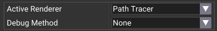

### Path Tracer

A Monte Carlo path tracer with global illumination, progressive accumulation, and physically based light transport. This is the primary ray tracing mode and the reference implementation for glTF PBR material accuracy.

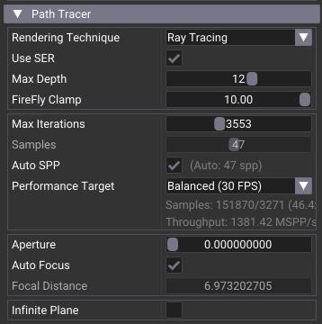

| Setting | Description |
|---|---|
| **Rendering Technique** | Choice between **Ray Tracing** (hardware RT pipeline with SBT) and **Ray Query** (compute shader). Both produce identical results; Ray Query avoids pipeline overhead on some workloads. |
| **Use SER** | Enable [Shader Execution Reorder](https://developer.nvidia.com/blog/improving-ray-tracing-performance-with-shader-execution-reorder/) for the Ray Tracing pipeline. Can improve coherence on RTX 40-series GPUs. |
| **FireFly Clamp** | Clamps high-intensity samples to reduce firefly artifacts in early frames. |
| **Max Iterations** | Maximum number of frames accumulated before the renderer stops. |
| **Samples** | Number of samples per pixel per frame. Higher = cleaner but slower per frame. |
| **Auto SPP** | Adaptive sampling: automatically adjusts samples-per-pixel to maintain a target frame rate. Choose between Interactive, Balanced, Quality, and Max Quality presets. |
| **Aperture** | Depth-of-field lens aperture. Set to 0 for a pinhole camera (everything in focus). |
| **Auto Focus** | Automatically sets the focal distance to the camera's interest point (double-click an object to set). |
| **Infinite Plane** | Adds an infinite ground plane with optional **Shadow Catcher** mode. When enabled, the plane subtracts light from the environment and adds only shadows and reflections — ideal for product shots. Surface properties (color, roughness, metallic) are adjustable. |

### AI-Accelerated Denoisers

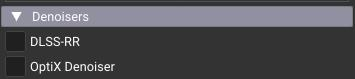

Two denoisers are available to reduce path tracing noise while preserving detail:

#### DLSS Ray Reconstruction (DLSS-RR)

[DLSS Ray Reconstruction](https://developer.nvidia.com/rtx/dlss) provides AI denoising with strong temporal stability for ray-traced content.

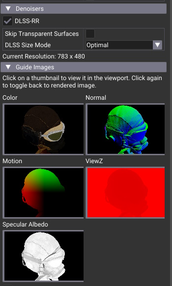

- When activated, select the rendering resolution (Min / Optimal / Max) — lower internal resolution means faster rendering, DLSS upscales to the viewport.
- View the AI guide buffers (albedo, normal, motion, depth, specular) by clicking on thumbnails. Click again to toggle back to the rendered image.
- Transparency handling can be set to "Default (first hit)" or "Improved (blended guides)" for scenes with alpha-blended materials.

**How to enable:** Set `USE_DLSS=ON` in CMake (enabled by default). The DLSS SDK is downloaded automatically. Requires an NVIDIA RTX 20-series or newer GPU and up-to-date drivers.

#### OptiX AI Denoiser

[OptiX AI Denoiser](https://developer.nvidia.com/optix-denoiser) uses albedo and normal guide buffers to preserve detail while removing Monte Carlo noise.

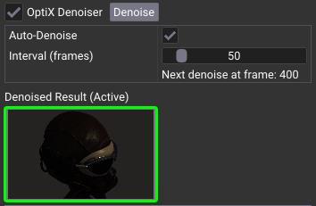

- Click the **Denoise** button to denoise the current accumulation, or enable **Auto-Denoise** to trigger automatically every N frames.
- The denoised image is visible when **Denoise Result** is active, indicated by a green outline.

**How to enable:** Set `USE_OPTIX_DENOISER=ON` in CMake (enabled by default when CUDA Toolkit is found). OptiX headers are downloaded automatically — no separate SDK install needed. Requires the [CUDA Toolkit](https://developer.nvidia.com/cuda-downloads) (11.0+).

### Rasterizer

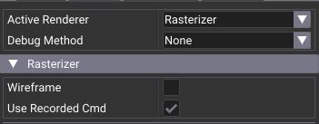

The rasterizer provides a fast PBR preview using forward rendering. It shares the same Vulkan resources as the path tracer:

- Scene geometry (vertex/index buffers)
- Material data (PBR parameters, textures)
- Shading functions (Slang shader modules)

It does not implement the full glTF PBR model and is not intended as the main material-reference implementation. It is designed as a fast navigation and fallback mode with shared scene resources.

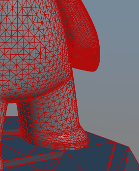

Wireframe mode can be toggled for mesh inspection.

---

## Environment

### Sun & Sky

A built-in physically based Sun & Sky shader module simulates atmospheric scattering. Adjust sun direction, turbidity, and ground albedo for different times of day and weather conditions.

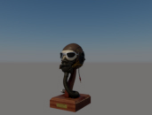 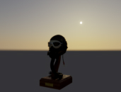 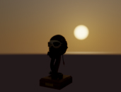

### HDR Environment

Lighting can come from HDR environment maps (`.hdr` files). Drag and drop an HDR file onto the viewport, or load via **File > Load HDR**.

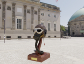 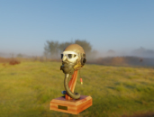 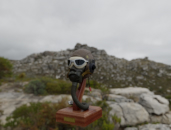 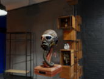 <br> 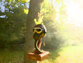 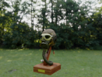 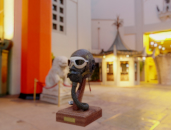 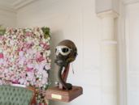

The environment can be **blurred** to soften reflections and lighting:

 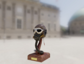 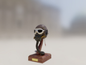 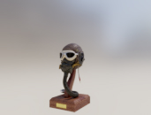

And **rotated** to position the light source where you need it:

 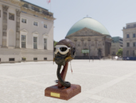

### Background

The background can also be a solid color. When saving as PNG, the alpha channel is preserved — useful for compositing renders over custom backgrounds.

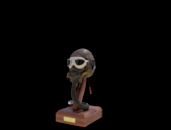 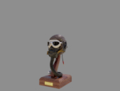 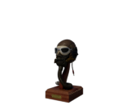

---

## Tone Mapping

A tone mapper is essential for converting HDR rendering output to displayable LDR images. Tone mapping is performed with a compute shader, and settings like exposure, contrast, saturation, and vignette are adjustable in real time.

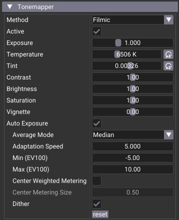

Supported tone mappers:

| Tone Mapper | Description |
|---|---|
| [**Filmic**](http://filmicworlds.com/blog/filmic-tonemapping-operators/) | Classic film-like response curve |
| **Uncharted 2** | Popular game tone mapper with good highlight rolloff |
| **Clip** | Simple gamma correction (linear to sRGB), no compression |
| [**ACES**](https://www.oscars.org/science-technology/sci-tech-projects/aces) | Academy Color Encoding System — the film industry standard |
| [**AgX**](https://github.com/EaryChow/AgX) | Modern filmic with excellent highlight handling |
| [**Khronos PBR**](https://github.com/KhronosGroup/ToneMapping/blob/main/PBR_Neutral/README.md#pbr-neutral-specification) | PBR Neutral — designed for faithful material appearance |

---

## Camera

Camera navigation follows the [Softimage](https://en.wikipedia.org/wiki/Softimage_(company)) default behavior. The camera always looks at a **point of interest** and orbits around it.

### Controls

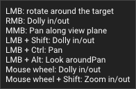

### Overview
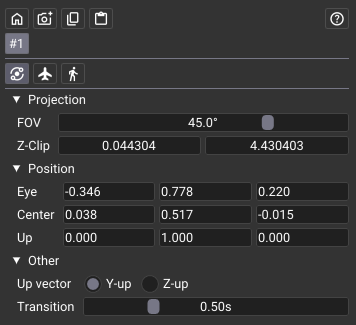

### Copy / Restore / Save

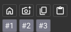

- Click the **home** icon to restore the camera to its original position.
- Click the **camera+** icon to save the current view; saved cameras appear as #1, #2, etc.
- Click the **copy** icon to store camera parameters in the clipboard (JSON format).
- Click the **paste** icon to set the camera from clipboard data.
- Click a **camera number** to recall that saved view.

### Navigation Modes 

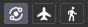

| Mode | Description |
|---|---|
| **Orbit** | Rotates around the point of interest. Double-click an object to re-center. |
| **Fly** | Free movement. Use `W` `A` `S` `D` to move, mouse to look. |
| **Walk** | Like Fly, but restricted to the horizontal (X-Z) plane. |

---

## Depth-of-Field

Depth of field is available in the path tracer under `Settings > Depth-of-Field`. Adjust aperture and focal distance for cinematic bokeh.

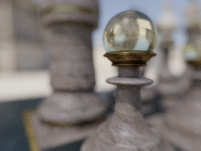 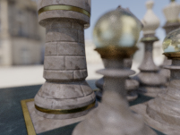

Use **Auto Focus** to automatically set the focal distance to the camera's interest point.

---

## Scene Asset Editor

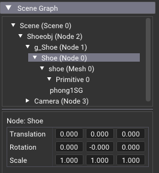

The application includes a full **glTF scene asset editor** that allows non-destructive modifications to the loaded scene. All changes operate directly on the in-memory glTF model and can be saved back to disk as `.gltf` or `.glb`.

### Scene Browser

The **Scene Browser** panel provides two complementary views:

- **Hierarchy view** — an interactive tree showing the full node graph with children, meshes, primitives, cameras, lights, and skins. Supports selection, expansion, drag-and-drop, and right-click context menus.
- **Flat list view** — tabbed lists of all Nodes, Meshes, Materials, Cameras, Lights, Textures, Images, and Animations with counts and quick selection.

Asset-level metadata (glTF asset info, generator, copyright, `KHR_xmp_json_ld`) is shown at the top.

### Node Operations

Right-click any node in the hierarchy or flat list:

| Operation | Shortcut | Description |
|---|---|---|
| **Add Child** | — | Create an empty child node, or a Point / Directional / Spot light node under the selected node |
| **Duplicate** | `Ctrl+D` | Deep-copy the node and its entire subtree (geometry, materials, hierarchy) |
| **Delete** | `Del` | Delete the node and all descendants (undoable) |
| **Rename** | — | Inline rename for any node, mesh, or material |
| **Re-parent** | Drag & drop | Drag a node onto another to re-parent it. Drop on the Scene root to make it a root node. Cycle detection prevents invalid hierarchies. |

### Undo / Redo

All node editing operations support full undo/redo:

| Shortcut | Action |
|---|---|
| `Ctrl+Z` | Undo the last operation |
| `Ctrl+Y` | Redo the last undone operation |

The **Edit** menu also provides Undo and Redo items with a description of the action (e.g., "Undo Transform 'Cube'", "Redo Delete 'Light'").

**Supported operations:** Transform (gizmo + inspector), Material editing (PBR properties + all extensions), Light editing (type, color, intensity, range, spot angles), Rename node, Duplicate, Delete, Add Child, Add Light, Re-parent (drag & drop).

The undo history uses a linear model: performing a new action after an undo discards the redo stack. History is automatically cleared when loading, merging, or compacting a scene to prevent stale references.

**Current limitations:**
- Visibility toggles and scene-level transforms are not yet undoable.
- If an animation is playing, it may overwrite an undo-restored transform on the next frame — pause the animation first.

### Transform Editing

- **Inspector panel**: Edit Translation, Rotation, and Scale (TRS) numerically with precision.
- **Transform Gizmo**: Enable via toolbar or `Settings > Show Gizmo` for interactive translate/rotate/scale directly in the viewport.
- **Scene Transform**: A popup on the scene root applies a global transform to all root nodes — useful for reorienting imported assets (e.g., Z-up to Y-up).

### Material Editing

The **Inspector** panel provides full PBR material editing when a material or primitive is selected:

- Base color factor and texture, metallic, roughness, emissive (factor + strength)
- Normal map scale, occlusion strength, alpha mode and cutoff
- Double-sided toggle
- All glTF PBR material extensions: clearcoat, transmission, volume, volume scatter, sheen, specular, IOR, iridescence, anisotropy, diffuse transmission, dispersion, emissive strength, unlit, and specular-glossiness
- Material copy/paste via clipboard (right-click on materials)

### Punctual Lights

The editor supports creating and editing **KHR_lights_punctual** lights — point, directional, and spot lights that are part of the glTF standard.

**Creating lights:**

- Right-click any node in the hierarchy and select **Add Child > Point Light / Directional Light / Spot Light**
- Right-click the Scene root and select **Add Point Light / Add Directional Light / Add Spot Light**
- Click the **+** button on the Lights group header in the flat list view

Each light is created as a new node in the scene graph. Position and orient the light by editing the node's transform (inspector or gizmo).

**Editing light properties:**

When a light is selected, the Inspector shows:

| Property | Applies to | Description |
|---|---|---|
| **Type** | All | Switch between point, directional, and spot |
| **Color** | All | Light color (edited in sRGB, stored as linear) |
| **Intensity** | All | Brightness multiplier |
| **Range** | Point, Spot | Maximum range of the light (0 = infinite) |
| **Inner Cone Angle** | Spot | Angle of full-intensity cone (radians) |
| **Outer Cone Angle** | Spot | Angle of light falloff cone (radians) |

All light property edits are undoable.

**Deleting lights:** Select the light's node in the hierarchy and delete it (`Del`). Use **Tools > Compact Scene** to remove orphaned light definitions from the file.

### Scene Merging

Multiple glTF files can be combined into a single scene:

- **File > Merge Scene** opens a file dialog to select a `.gltf` or `.glb` file
- **Shift + Drag & Drop** a file onto the viewport to merge instead of replace
- Merged content is wrapped under a new root node, preserving both scenes' hierarchies
- Texture count is validated against the GPU descriptor limit before merging

### Save and Compact

- **File > Save / Save As** writes the modified scene to `.gltf` or `.glb`, including all edits (transforms, hierarchy changes, material tweaks, merged content, image copying)
- **Tools > Compact Scene** removes orphaned resources (unused meshes, materials, textures, images, accessors, buffer views, buffers) left behind by delete/merge operations — reduces file size and cleans up the model

### Visibility

Nodes with the `KHR_node_visibility` extension can be toggled visible/hidden directly from the hierarchy. Visibility propagates to children and is reflected in both renderers immediately.

---

## Animation

If the loaded scene contains animations, an **Animation** control panel appears:

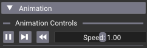

- **Play / Pause** the active animation
- **Step** forward one frame at a time
- **Reset** to the beginning
- Adjust **playback speed** (0.1x to 10x)
- **Timeline scrubbing** — drag the slider to any time position

Supported animation types: keyframe translation/rotation/scale, skeletal skinning, morph targets, and `KHR_animation_pointer` (animated material and light properties).

## Multiple Scenes

If the glTF file contains multiple scenes, a scene selector appears. Click a scene name to switch.

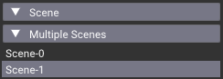

## Material Variants

If the scene uses `KHR_materials_variants`, a variant selector shows all variant names. Click to apply a variant to all meshes that support it.

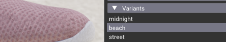

---

## Debug Visualization

Inspect individual material channels to diagnose shading issues:

|metallic|roughness|normal|base color|emissive|opacity|tangent|tex coord|
|---|---|---|---|---|---|---|---|
|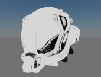|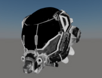|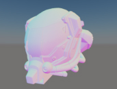|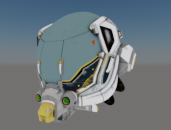|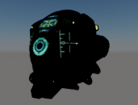|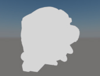|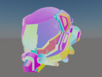|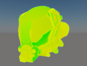|

Select the debug channel from the **Debug** menu or settings panel.

---

## Material Feature Showcase

The ray tracing path tracer implements all glTF PBR material extensions with physically accurate results. Here is a selection of material features in action:

| | |
|--|--|
| Anisotropy | 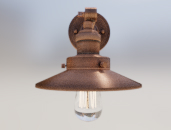 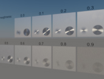 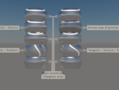 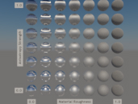 <br> 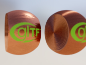|
| Attenuation | 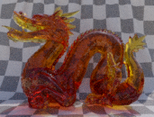 |
| Alpha Blend |   |
| Clear Coat |    |
| Dispersion |    |
| IOR |   |
| Emissive |   |
| Iridescence |     |
| Punctual Lights |   |
| Sheen |     |
| Transmission |     <br>    |
| Volume |   |
| Variant |    |
| Others |       <br>       |

---

## Tools

### GPU Profiler

Measure time spent on each rendering stage (path tracing, rasterization, tone mapping, UI) with per-frame GPU timestamps.


### Logger

A dockable log window showing all application messages. Filter by level (Info, Warning, Error) to focus on what matters.


### NVML GPU Monitor

Real-time GPU monitoring via NVML: temperature, power draw, memory usage, and clock speeds. Useful for identifying thermal throttling during long renders.


### Tangent Space Repair

Repair or regenerate the model's tangent space when normal maps look incorrect or tangent-related validation errors appear.

| Method | Description |
|---|---|
| **Simple** | UV gradient method — fast, good for most cases. Based on [Foundations of Game Engine Development](https://foundationsofgameenginedev.com/FGED2-sample.pdf). |
| **MikkTSpace** | Industry-standard algorithm from [mikktspace.com](http://www.mikktspace.com/). Handles UV seams correctly with vertex splitting. |

### Shader Hot-Reload

Press **F5** or use `Tools > Recompile Shaders` to hot-reload all Slang shaders without restarting the application. Shader source files in the `shaders/` directory are recompiled on-the-fly, making it ideal for rapid shader development and debugging.

> **Note:** Hot-reload requires the Slang compiler and shader source files to be accessible at runtime (handled automatically by the build system's `copy_to_runtime_and_install`).

### Exporting Images

| Action | Shortcut | Description |
|---|---|---|
| **Save Image** | `Ctrl+Shift+S` | Save the current tonemapped render to a PNG file (alpha channel preserved for compositing). |
| **Save Screen** | `Ctrl+Alt+Shift+S` | Save a screenshot of the full application window including UI. |

Both are also available from **File > Save Image** and **File > Save Screen**.

### Memory Statistics

Open via **Tools > Memory Usage**. Displays GPU memory allocation broken down by category (textures, buffers, acceleration structures, etc.). Useful for tracking memory consumption on large scenes.

---

## Configuration

### Settings File

The application creates a `vk_gltf_renderer.ini` file next to the executable, which persists:

- UI layout and window positions (via ImGui)
- User preferences (axis visibility, grid display, gizmo state)
- Selected renderer type (path tracer or rasterizer)
- Path tracer settings (technique, adaptive sampling, performance target)
- DLSS settings (enable, size mode)
- Last used environment and rendering options

If you encounter UI issues or want to reset all settings to defaults, delete this file. It will be recreated with default values on the next launch.

### Command-Line Reference

All settings can be overridden from the command line using `--paramName value` syntax.

**General**

| Parameter | Description |
|---|---|
| `--scenefile <path>` | Input scene file (.gltf, .glb) |
| `--hdrfile <path>` | Input HDR environment file (.hdr) |
| `--size <W> <H>` | Window size |
| `--headless` | Run without UI (batch mode) |
| `--frames <N>` | Number of frames to render in headless mode |
| `--vsync` | Enable vertical sync |
| `--vvl` | Activate Vulkan Validation Layers |
| `--logLevel <0-2>` | Log level: Info (0), Warning (1), Error (2) |
| `--logShow <0-3>` | Extra log info (bitset): None (0), Time (1), Level (2) |
| `--device <index>` | Force a specific Vulkan GPU by device index |
| `--vsyncOffMode <0-3>` | VSync-off present mode: Immediate (0), Mailbox (1), FIFO (2), FIFO Relaxed (3) |
| `--floatingWindows` | Allow dock windows to be separate OS windows |

**Display**

| Parameter | Description |
|---|---|
| `--showAxis` | Show the 3D axis widget in the viewport |
| `--showMemStats` | Open the Memory Statistics window on launch |
| `--silhouetteColor <R> <G> <B>` | Selection silhouette color (0.0-1.0) |

**Rendering**

| Parameter | Description |
|---|---|
| `--renderSystem <0-1>` | Path tracer (0) or Rasterizer (1) |
| `--envSystem <0-1>` | Sky (0) or HDR (1) |
| `--maxFrames <N>` | Maximum path tracer iterations |
| `--debugMethod <N>` | Debug visualization method |
| `--useSolidBackground` | Use solid background color |
| `--solidBackgroundColor <R> <G> <B>` | Solid background color (0.0-1.0) |

**Path Tracer**

| Parameter | Description |
|---|---|
| `--ptTechnique <0-1>` | Ray Query (0) or Ray Tracing pipeline (1) |
| `--ptMaxDepth <N>` | Maximum ray bounce depth |
| `--ptSamples <N>` | Samples per pixel per frame |
| `--ptFireflyClamp <val>` | Firefly clamp threshold |
| `--ptAperture <val>` | Depth-of-field aperture |
| `--ptFocalDistance <val>` | Focal distance |
| `--ptAutoFocus` | Enable auto-focus |
| `--ptAdaptiveSampling` | Enable adaptive SPP to meet FPS target |
| `--ptPerformanceTarget <0-3>` | Interactive (0), Balanced (1), Quality (2), Max Quality (3) |

**Rasterizer**

| Parameter | Description |
|---|---|
| `--rasterWireframe` | Enable wireframe mode |
| `--rasterUseRecordedCmd` | Use recorded (secondary) command buffers |

**Denoisers**

| Parameter | Description |
|---|---|
| `--dlssEnable` | Enable DLSS Ray Reconstruction |
| `--optixEnable` | Enable OptiX AI Denoiser |
| `--optixAutoDenoiseEnabled` | Auto-denoise every N frames |
| `--optixAutoDenoiseInterval <N>` | Auto-denoise interval (frames) |

**Tone Mapping**

| Parameter | Description |
|---|---|
| `--tmMethod <0-5>` | Filmic (0), Uncharted (1), Clip (2), ACES (3), AgX (4), Khronos PBR (5) |
| `--tmExposure <val>` | Exposure |
| `--tmGamma <val>` | Brightness |
| `--tmContrast <val>` | Contrast |
| `--tmSaturation <val>` | Saturation |
| `--tmWhitePoint <val>` | Vignette |

**Environment**

| Parameter | Description |
|---|---|
| `--hdrEnvIntensity <val>` | HDR environment intensity |
| `--hdrEnvRotation <val>` | HDR environment rotation |
| `--hdrBlur <val>` | HDR environment blur |

**Headless / Batch Rendering Example:**

```bash
./vk_gltf_renderer --headless --scenefile shader_ball.gltf --hdrfile daytime.hdr --envSystem 1 --frames 1000
```

---

## Utilities

### gltf-material-modifier.py

Located in `utils/gltf-material-modifier.py`. A Python 3 script to batch-modify materials in a glTF file and optionally reorient the scene from Z-up to Y-up.

```
usage: gltf-material-modifier.py [-h] [--metallic METALLIC] [--roughness ROUGHNESS] [--override] [--reorient]
                                 input_file output_file
```

| Argument | Description |
|---|---|
| `input_file` | Path to the input glTF file |
| `output_file` | Path to save the modified glTF file |
| `--metallic` | Set metallic factor (default: 0.1) |
| `--roughness` | Set roughness factor (default: 0.1) |
| `--override` | Override existing material values |
| `--reorient` | Reorient the scene from Z-up to Y-up |

---

## Troubleshooting

**Application won't start / black screen**
- Ensure you have an NVIDIA RTX GPU with up-to-date drivers (535+).
- Verify the Vulkan SDK is installed: run `vulkaninfo` from a terminal.
- Try with validation layers: `--vvl` to get detailed Vulkan error messages.

**DLSS not available**
- DLSS requires an RTX 20-series or newer GPU and the `USE_DLSS=ON` CMake option.
- Check that the NGX runtime is present; it is downloaded automatically during the build.
- The application will still run with DLSS disabled if hardware support is missing.

**OptiX AI Denoiser not working**
- Ensure the [CUDA Toolkit](https://developer.nvidia.com/cuda-downloads) is installed and found by CMake.
- On Windows, `cudart64_*.dll` is delay-loaded — the application starts without it, but the denoiser tab will show as unavailable.
- OptiX headers are auto-downloaded; no separate OptiX SDK install is needed.

**Shader hot-reload fails (F5)**
- Hot-reload requires the Slang compiler and shader source files to be accessible at runtime.
- Verify the `shaders/` directory is present next to the executable (handled by `copy_to_runtime_and_install`).

**Resetting UI layout**
- Delete the `vk_gltf_renderer.ini` file next to the executable. It will be recreated with defaults on the next launch.
