# User Guide — Vulkan glTF Renderer (Ray Tracing & PBR)

> **For users.** How to run and use the app — RTX path tracer, PBR rasterizer, AI denoisers, scene editor, camera, environment, tone mapping, and the common CLI flags. For project overview and build instructions see the [README](../README.md); for internals and the authoritative flag/enum lists, see the [Developer Guide](developer.md) and the code.

## Quick Navigation

- [Renderer Modes](#renderer)
- [Environment](#environment)
- [Tone Mapping](#tone-mapping)
- [Camera](#camera)
- [Depth-of-Field](#depth-of-field)
- [Scene Asset Editor](#scene-asset-editor)
- [Animation](#animation)
- [Debug Visualization](#debug-visualization)
- [Tools](#tools)
- [Configuration and CLI](#configuration)
- [Troubleshooting](#troubleshooting)

## Recommended First Run

1. Launch the app and load a `.gltf`/`.glb` scene (`.obj` files are also accepted and converted to glTF on the fly).
2. Switch between Rasterizer and Path Tracer in the **Settings** panel.
3. Load an HDR environment or use Sun and Sky.
4. Enable a denoiser (DLSS-RR or OptiX) in path tracing mode.
5. Save a modified scene as `.gltf` or `.glb` from the **File** menu.

---

## Renderer

The application provides two Vulkan renderer modes that share GPU resources (geometry, materials, textures, and shading code). The **Path Tracer** is the primary quality reference for ray tracing and PBR materials; the **Rasterizer** is the fast fallback preview mode. Switch at any time from the **Settings** panel.

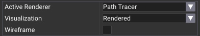

### Path Tracer

A Monte Carlo path tracer with global illumination, progressive accumulation, and physically based light transport. This is the primary ray tracing mode and the reference implementation for glTF PBR material accuracy.

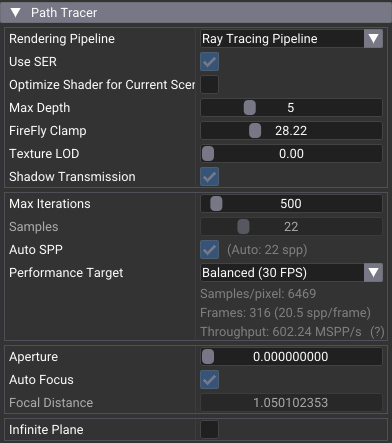

| Setting                 | Description                                                                                                                                                                                                                                                                                                                                                                                                                                                                                                                                                                                                                                                                                                                                                                                                         |
| ----------------------- | ------------------------------------------------------------------------------------------------------------------------------------------------------------------------------------------------------------------------------------------------------------------------------------------------------------------------------------------------------------------------------------------------------------------------------------------------------------------------------------------------------------------------------------------------------------------------------------------------------------------------------------------------------------------------------------------------------------------------------------------------------------------------------------------------------------------- |
| **Rendering Pipeline**  | Choice between **Compute / Ray Query** (compute shader) and **Ray Tracing Pipeline** (hardware RT pipeline with SBT). Both produce identical results; Ray Query avoids pipeline overhead on some workloads.                                                                                                                                                                                                                                                                                                                                                                                                                                                                                                                                                                                                         |
| **Use SER**             | Enable [Shader Execution Reorder](https://developer.nvidia.com/blog/improving-ray-tracing-performance-with-shader-execution-reorder/) for the Ray Tracing pipeline. Can improve coherence on RTX 40-series GPUs.                                                                                                                                                                                                                                                                                                                                                                                                                                                                                                                                                                                                    |
| **Max Depth**           | Maximum number of bounces per path.                                                                                                                                                                                                                                                                                                                                                                                                                                                                                                                                                                                                                                                                                                                                                                                 |
| **FireFly Clamp**       | Clamps high-intensity samples to reduce firefly artifacts in early frames.                                                                                                                                                                                                                                                                                                                                                                                                                                                                                                                                                                                                                                                                                                                                          |
| **Texture LOD**         | Ray-footprint gradient scale for texture mip selection: 0 always samples mip 0, 1 uses the full physically derived LOD.                                                                                                                                                                                                                                                                                                                                                                                                                                                                                                                                                                                                                                                                                             |
| **Shadow Transmission** | Lets shadow rays pass through transmissive surfaces (`KHR_materials_transmission`), tinted by their color and absorption, for brighter glass and colored shadows. A **biased approximation**: refraction is ignored. Off is unbiased, but caustics from small or punctual lights go missing. |
| **Max Iterations**      | Maximum number of frames accumulated before the renderer stops.                                                                                                                                                                                                                                                                                                                                                                                                                                                                                                                                                                                                                                                                                                                                                     |
| **Samples**             | Number of samples per pixel per frame. Higher = cleaner but slower per frame.                                                                                                                                                                                                                                                                                                                                                                                                                                                                                                                                                                                                                                                                                                                                       |
| **Auto SPP**            | Adaptive sampling: automatically adjusts samples-per-pixel to maintain a target frame rate. Choose between Interactive, Balanced, Quality, and Max Quality presets.                                                                                                                                                                                                                                                                                                                                                                                                                                                                                                                                                                                                                                                 |
| **Aperture**            | Depth-of-field lens aperture. Set to 0 for a pinhole camera (everything in focus).                                                                                                                                                                                                                                                                                                                                                                                                                                                                                                                                                                                                                                                                                                                                  |
| **Auto Focus**          | Automatically sets the focal distance to the camera's interest point (double-click an object to set).                                                                                                                                                                                                                                                                                                                                                                                                                                                                                                                                                                                                                                                                                                               |
| **Infinite Plane**      | Adds an infinite ground plane with optional **Shadow Catcher** mode. When enabled, the plane subtracts light from the environment and adds only shadows and reflections — ideal for product shots. Surface properties (color, roughness, metallic) are adjustable.                                                                                                                                                                                                                                                                                                                                                                                                                                                                                                                                                  |

### AI-Accelerated Denoisers

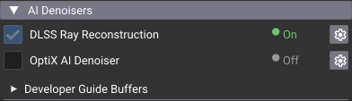

Two denoisers are available to reduce path tracing noise while preserving detail:

#### DLSS Ray Reconstruction (DLSS-RR)

[DLSS Ray Reconstruction](https://developer.nvidia.com/rtx/dlss) provides AI denoising with strong temporal stability for ray-traced content.

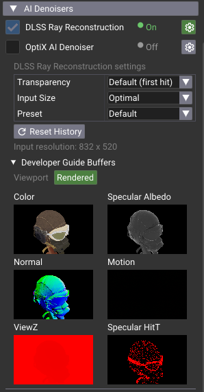

- Enable or disable it from the denoiser activation row; the status appears next to the row label. **Loading** means the nonblocking NGX prewarm is running, **Ready** means it can be enabled without waiting for startup initialization, and **On** means it is actively denoising the current frame.
- Open the row's settings button to choose the input size (Min / Optimal / Max) — lower internal resolution means faster rendering, DLSS upscales to the viewport.
- Developer guide-buffer previews (albedo, normal, motion, depth, specular) live at the bottom of the panel under **Developer Guide Buffers**. Use **Rendered** to switch back to the main image.
- **Transparency** (`--dlssTransparency`) controls what the guides describe on clear glass. **Default** uses the glass surface itself. **Improved** uses the surface seen through every glass layer, which keeps content behind glass sharp while the camera moves (rough or tinted glass, and other materials, are unaffected). See [denoising.md](denoising.md#clear-glass-primary-surface-replacement).

**How to enable:** Set `USE_DLSS=ON` in CMake (enabled by default). The DLSS SDK is downloaded automatically. Requires an NVIDIA RTX 20-series or newer GPU and up-to-date drivers.

#### DLSS Neural Rendering (DLSS-NR)

DLSS-NR is a display-resolution **image enhancer** that runs on top of DLSS-RR or DLSS-SR. It
operates on the tonemapped (LDR) image and applies learned local tone and structure adjustments.
Enable it in the DLSS panel once the main DLSS feature is available. In path tracing mode, DLSS-RR
must be enabled because NR needs a denoised input.

Open the row's settings button to edit:
- **Intensity** — overall NR effect strength.
- **Local Tone** — adjusts local luminance contrast.
- **Local Structure** — sharpens or smooths local detail; most visible on high-frequency surfaces.
- **Global Tone** — adjusts global tone mapping strength applied by NR.
- **Skin Structure** — NR-specific skin-detail preservation.
- **Style** — NR processing style preset (SDK-defined).
- **Auto Mask** — let NR derive its own per-pixel mask instead of using `EXT_DLSS_NR`.

**Per-material NR mask (`EXT_DLSS_NR`):** Add the `EXT_DLSS_NR` extension to any material in the
**Material Extensions** section of the Inspector to override NR strengths per object. Each channel
multiplies the corresponding global setting for pixels covered by that material:

| Channel | Global setting it scales |
|---|---|
| Intensity | Intensity |
| Local Tone | Local Tone |
| Local Structure | Local Structure |
| Global Tone | Global Tone |

Default `(1, 1, 1, 1)` leaves global values unchanged. Set a channel to `0` to fully suppress
that effect on the material's pixels. This enables per-character NR tuning — for example, disabling
local structure on a background prop while keeping it on a foreground character.

> The per-material mask is written by the path tracer only. It has no effect when the rasterizer
> is active (the rasterizer falls back to the global `Use Auto Mask` setting).

**How to enable:** Requires `USE_DLSSNR=ON` in CMake plus a compatible beta NGX SDK.

#### OptiX AI Denoiser

[OptiX AI Denoiser](https://developer.nvidia.com/optix-denoiser) uses albedo and normal guide buffers to preserve detail while removing Monte Carlo noise.

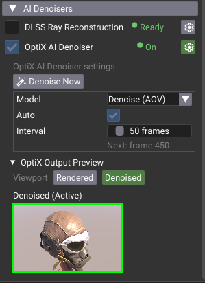

- Enable or disable it from the denoiser activation row; the status appears next to the row label.
- Open the row's settings button, then click **Denoise Now** to denoise the current accumulation, or enable **Auto** to trigger automatically every N frames.
- Use the **Rendered** / **Denoised** viewport toggle in **OptiX Output Preview** to compare the current render with the OptiX result.

**How to enable:** Set `USE_OPTIX_DENOISER=ON` in CMake (enabled by default when CUDA Toolkit is found). OptiX headers are downloaded automatically — no separate SDK install needed. Requires the [CUDA Toolkit](https://developer.nvidia.com/cuda-downloads) (11.0+).

### Opacity Micromap (EXT_mesh_opacity_micromap)

[Opacity Micromaps (OMM)](https://developer.nvidia.com/blog/improve-ray-tracing-performance-with-opacity-micromaps/) pre-classify each micro-triangle in alpha-tested geometry as opaque, transparent, or unknown. The ray tracer skips the any-hit shader for opaque micro-triangles, eliminating per-ray alpha evaluation on most of the surface.

This renderer loads scenes that already contain `EXT_mesh_opacity_micromap` data and binds it when building the BLAS. Bake OMMs with [gltf_omm_baker](https://github.com/nvpro-samples/gltf_omm_baker), which writes the extension into the glTF file.

The **Opacity Micromap** visualization mode (Settings → Visualization) is a debug view for alpha-tested geometry that shows where the ray tracer still pays for alpha (any-hit) shading. Surfaces resolved by an opacity micromap as opaque are drawn green (no alpha work); "unknown" micro-triangles that still run the alpha shader are drawn yellow; transparent micro-triangles are culled, so those pixels show the environment behind. On a scene without an opacity micromap the whole alpha-tested surface reads yellow, illustrating the cost the OMM removes. The view is meaningful in the RayTracing (RT pipeline) technique, which consults the micromap.

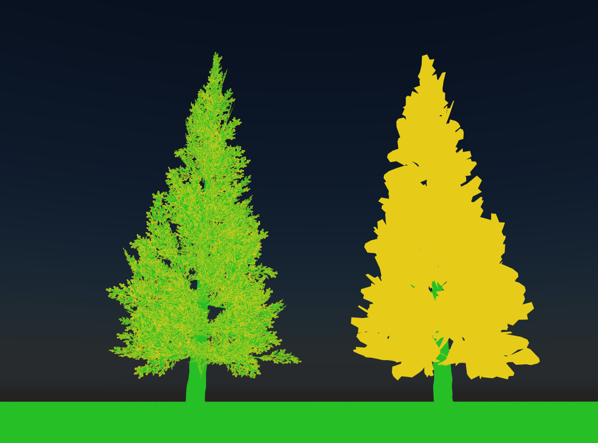

### Rasterizer

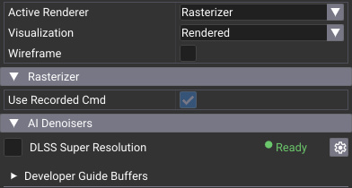

The rasterizer provides a fast PBR preview using forward rendering. It shares the same Vulkan resources as the path tracer:

- Scene geometry (vertex/index buffers)
- Material data (PBR parameters, textures)
- Shading functions (Slang shader modules)

It does not implement the full glTF PBR model and is not intended as the main material-reference implementation. It is designed as a fast navigation and fallback mode with shared scene resources.

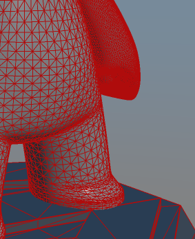

Wireframe mode can be toggled for mesh inspection.

---

## Environment

**Environment Type** picks what lights the scene and what shows behind it; hover an entry for a
description.

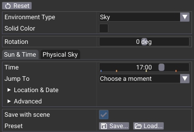

**Reset** restores the selected type to its defaults and leaves everything else alone (other sky
types, the loaded HDR, the background color). **Windows > Reset All to Default** resets the whole
application. Scripts can use `--envResetDefaults`.

**Rotation** turns the environment about the vertical axis, in degrees (a **Plain** sky has
nothing to turn). It also sets where north is, so turning a sky moves its sun with it; see
[Sun & Time of Day](#sun--time-of-day). A tilt stored in a glTF's `rotation` is kept, and
`--envRotation x y z w` sets the full quaternion.

### Authored skies

**Plain**, **Gradient** and **Sky** come from the
[OMI_environment_sky](https://github.com/omigroup/gltf-extensions/tree/main/extensions/2.0/OMI_environment_sky)
glTF extension (**Sky** is its `physical` type). They are scene data: a scene that carries the
extension selects its own sky on load, and **Save with scene** writes the current sky back.

- **Plain** — one solid color that lights the scene and shows as the background. Black looks like
  **None** but keeps the sky in the file; pick **None** for the faster no-environment path.
- **Gradient** — bottom, horizon and top colors with a curve on each half (1.0 is linear; smaller
  values sharpen the horizon), plus a sun disk and glow.
- **Sky** — a physical atmosphere. It reddens as the sun gets low, and below the horizon it shows
  lit ground, which also bounces warm light onto the scene.

### Editing the atmosphere

**Sky** and **Gradient** each have two tabs: **Sun & Time** aims the sun, and **Physical Sky** /
**Gradient Sky** sets the look. **Preset** at the top of Physical Sky applies Earth, Mars or an alien
atmosphere; editing any value switches it to *Custom*.

The Physical Sky groups:

- **Rayleigh** — scattering by air, blue on Earth: strength, tint, and how fast it thins with height.
- **Mie** — haze, dust and smoke: strength, tint, height falloff, **Anisotropy** (how tight the glow
  around the sun is) and **Albedo** (how much it scatters rather than absorbs).
- **Ozone** — a high layer that absorbs rather than scatters: strength, height and thickness.
- **Aerial Perspective** — haze between the camera and the scene; see
  [Aerial perspective](#aerial-perspective).
- **Planet** — ground radius and albedo, atmosphere thickness, and **Observer Altitude**.
- **Sun** — **Angular Radius** (wider gives softer shadows) and **Irradiance**.

While you drag a slider the sky updates at reduced quality, and it settles when you release.

### Sky presets

**Preset → Save… / Load…** at the bottom of the Environment panel saves the current sky as a
`.sky.json` or applies one; you can also drop a `.sky.json` on the viewport. A preset stores the
whole sky plus the sun's angle; one saved without a sun leaves yours where it is. The file is plain
JSON: the same `OMI_environment_sky` entry a scene carries.

```bash
vk_gltf_renderer --scenefile scene.gltf --loadSkyPreset presets/blue_hour.sky.json
```

`--loadSkyPreset` wins over both the saved settings and the scene's own sky; `--saveSkyPreset`
writes the sky that is showing. Loading a preset can't be undone, except for the sun's move when a
scene light is the sun.

### Aerial perspective

The haze that makes distant objects pale and blue. **Sky → Aerial Perspective** sets how many metres
of air one scene unit represents: 1.0 matches glTF's metres, 0 turns it off. Small assets show
almost nothing, which is expected; raise the value for scenes modeled at a smaller scale, or raise
**Mie Scattering** for a hazier day.

The path tracer shadows the haze (sun shafts, dark interiors); the rasterizer's haze is unshadowed.

### Sky brightness

The **Sky** type is calibrated to match a typical HDR, so it works at exposure 1.0. The scene
darkens as the sun sets; that is physically correct.

### The sky's sun

A sky with a sun is lit by a directional light. **Sun Source** (under **Sun & Time of Day →
Advanced**) picks it: *Renderer* for a built-in sun, or one of the scene's directional lights. The
Inspector has the same switch on a directional light (**Sky's Sun**), and the Scene Browser shows
that light with a sun icon. The choice is undoable and saved with the file.

- Choosing an environment never edits your scene. Saving with **Save with scene** on writes the
  built-in sun as a light, so the sky stays lit in other viewers.
- Moving the sun light moves the sky, and the panel's sliders move the light, undoably.
- The sun has a size: widen **Angular Radius** (**Physical Sky → Sun**) for softer shadows.
- A gradient sky's sun is scaled to the sky's brightness; **Sun Color** sets its color and strength.
- Other directional lights stay as authored, with hard shadows. Give one a `radius` in its `extras`
  for soft ones.

### Sky in the glTF file

A `physical` sky loads as the **Sky** type with the file's scattering and ground color. What the
extension cannot describe (planet size, ozone, solar spectrum) is saved in an
`NV_environment_sky_atmosphere` block, along with the sun's angular radius; a file without one
leaves those settings as they are. Observer altitude is a viewer setting, kept in the `.ini`. A
`panorama` round-trips and loads as an HDR environment.

### Sun & Time of Day

This tab aims the one sun shared by the **Sky** and **Gradient** types.

- **Time** — drag it and the sun moves to where it really was at that moment, for the place and
  date under **Advanced → Location & Date**. The ticks under the slider mark solar midnight,
  sunrise, noon and sunset.
- **Jump To** — named moments such as sunrise, golden hour and blue hour, solved for your latitude
  and date. Moments that don't happen that day (sunrise at Tromsø in December) are greyed out.

North comes from the environment's **Rotation**. With no rotation, north is −Z and east is +X in a
Y-up scene; in a Z-up scene north is −Y.

**Advanced** holds **Sun Source**, exact **Azimuth** / **Elevation**, **Gizmo on sun light**
(selects the sun light and shows the transform gizmo; needs a scene light as the sun), and
**Location & Date**: **Now** fills today's date, time and UTC offset from this machine, then
**City**, latitude and longitude, date, and **UTC Offset**. Offsets are standard time, with no
daylight saving, so adjust **UTC Offset** for a summer date.

Location, date and time are saved in the `.ini`, not in the glTF, which keeps the sun light's
direction instead. They are also command-line flags:

```bash
vk_gltf_renderer --envSystem 0 --todCity Tokyo --todDate 2026-06-21 --todHour 16.5
```

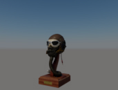 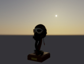 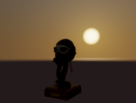

### HDR Environment

Lighting can come from environment maps — Radiance `.hdr` or OpenEXR `.exr`. Drag and drop one onto
the viewport, or load via **File > Load HDR Environment** (`Ctrl+Shift+O`). The format is detected
from the file's contents, so a mis-spelled extension still loads.

With **Save with scene** enabled, the environment is written into the glTF as an
`OMI_environment_sky` `panorama` and reloads with the scene — the image itself stays an external
file, referenced by a URI relative to the glTF.

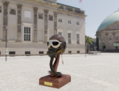 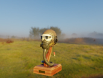 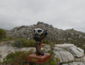 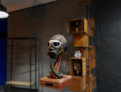 <br> 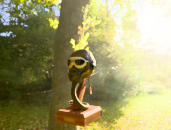 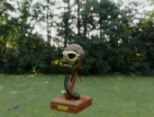  

The environment can be **blurred** to soften reflections and lighting:

 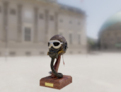  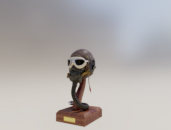

And **rotated** — with the panel's **Orientation**, shared by every environment — to position the light source where you need it:

 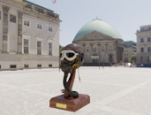

### No Environment

Setting the **Environment Type** to **None** disables every environment type entirely: the scene receives no environment lighting (only its own punctual and emissive lights contribute), and unless a **Solid Color** background is enabled the backdrop is black. Prefer this over dialing HDR intensity to zero — it also skips environment importance sampling and the dome pass.

If **None** is selected while the scene has neither punctual lights nor emissive materials, nothing is lit. With no **Solid Color** background the frame is then fully black, so the viewport shows a warning banner in that case so the empty result isn't mistaken for a bug.

### Background

The background can also be a solid color. When saving as PNG, the alpha channel is preserved — useful for compositing renders over custom backgrounds.

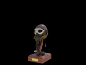 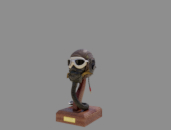 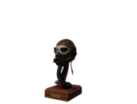

---

## Tone Mapping

A tone mapper is essential for converting HDR rendering output to displayable LDR images. Tone mapping is performed with a compute shader, and settings like exposure, contrast, saturation, and vignette are adjustable in real time.

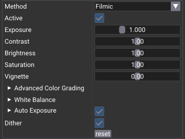

Supported tone mappers:

| Tone Mapper | Description |
|---|---|
| [**Filmic**](http://filmicworlds.com/blog/filmic-tonemapping-operators/) | Classic film-like response curve |
| **Uncharted 2** | Popular game tone mapper with good highlight rolloff |
| **Clip** | Simple gamma correction (linear to sRGB), no compression |
| [**ACES**](https://www.oscars.org/science-technology/sci-tech-projects/aces) | Academy Color Encoding System — the film industry standard |
| [**AgX**](https://github.com/EaryChow/AgX) | Modern filmic with excellent highlight handling |
| [**Khronos PBR**](https://github.com/KhronosGroup/ToneMapping/blob/main/PBR_Neutral/README.md#pbr-neutral-specification) | PBR Neutral — designed for faithful material appearance |

---

## Camera

Camera navigation follows the [Softimage](https://en.wikipedia.org/wiki/Softimage_(company)) default behavior. The camera always looks at a **point of interest** and orbits around it.

### Controls

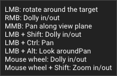

### Overview
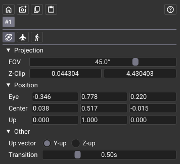

### Copy / Restore / Save

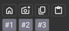

- Click the **home** icon to restore the camera to its original position.
- Click the **camera+** icon to save the current view; saved cameras appear as #1, #2, etc.
- Click the **copy** icon to store camera parameters in the clipboard (JSON format).
- Click the **paste** icon to set the camera from clipboard data.
- Click a **camera number** to recall that saved view.

### Navigation Modes 

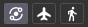

| Mode | Description |
|---|---|
| **Orbit** | Rotates around the point of interest. Double-click an object to re-center. |
| **Fly** | Free movement. Use `W` `A` `S` `D` to move, mouse to look. |
| **Walk** | Like Fly, but restricted to the horizontal (X-Z) plane. |

---

## Depth-of-Field

Depth of field is available in the path tracer under **Settings → Path Tracer** (Aperture, Auto Focus, Focal Distance). Adjust aperture and focal distance for cinematic bokeh.

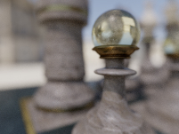 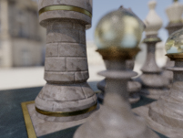

Use **Auto Focus** to automatically set the focal distance to the camera's interest point.

---

## Scene Asset Editor

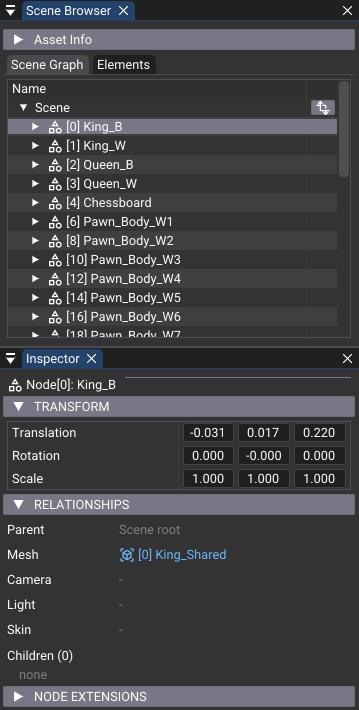

The application includes a full **glTF scene asset editor** that allows non-destructive modifications to the loaded scene. All changes operate directly on the in-memory glTF model and can be saved back to disk as `.gltf` or `.glb`.

### Scene Browser

The **Scene Browser** panel provides two complementary tabs:

- **Scene Graph** — an interactive tree showing the full node graph with children, meshes, primitives, cameras, lights, and skins. Supports selection, expansion, drag-and-drop, and right-click context menus.
- **Elements** — an editor-grade list with one icon tab per glTF collection (Nodes, Meshes, Materials, Cameras, Lights, Textures, Images, Samplers, Animations). Each row shows the element's **glTF index (`#`)**, its name, and a few browse columns that make the list an asset-review tool — mesh **triangles**/**instances**, material **used-by** with a color swatch, image **resolution** and **reference count**, animation **duration**, and so on. Columns are click-to-sort (e.g. heaviest mesh, largest texture), there is a name **filter**, and the footer shows aggregates (total triangles, texture memory). A uniform toolbar provides **Add / Duplicate / Delete / Rename** per category; selecting a row drives the **Inspector**. Nodes also carry an inline visibility (eye) toggle. Selection stays in sync with the Scene Graph tree and the viewport.

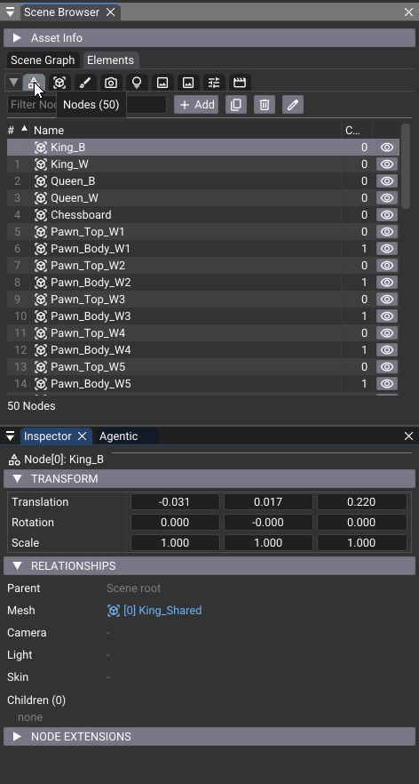

Asset-level metadata (glTF asset info, generator, copyright, `KHR_xmp_json_ld`) is shown at the top.

### Node Operations

Right-click any node in the Scene Graph tree, use the Elements tab's Nodes toolbar, or press the shortcuts:

| Operation | Shortcut | Description |
|---|---|---|
| **Add Child** | — | Create an empty child node, or a Point / Directional / Spot light node under the selected node |
| **Duplicate** | `Ctrl+D` | Deep-copy the node and its entire subtree (geometry, materials, hierarchy) |
| **Delete** | `Del` | Delete the node and all descendants (undoable) |
| **Rename** | — | Inline rename for any node, mesh, or material |
| **Re-parent** | Drag & drop | Drag a node onto another to re-parent it. Drop on the Scene root to make it a root node. Cycle detection prevents invalid hierarchies. |

### Undo / Redo

All node editing operations support full undo/redo:

| Shortcut | Action |
|---|---|
| `Ctrl+Z` | Undo the last operation |
| `Ctrl+Y` | Redo the last undone operation |

The **Edit** menu also provides Undo and Redo items with a description of the action (e.g., "Undo Transform 'Cube'", "Redo Delete 'Light'").

**Supported operations:** Transform (gizmo + inspector), Material editing (PBR properties + all extensions), Light editing (type, color, intensity, range, spot angles), Rename node, Duplicate, Delete, Add Child, Add Light, Re-parent (drag & drop).

The undo history uses a linear model: performing a new action after an undo discards the redo stack. History is automatically cleared when loading, merging, or referencing a scene to prevent stale references.

**Current limitations:**
- Visibility toggles and scene-level transforms are not yet undoable.
- If an animation is playing, it may overwrite an undo-restored transform on the next frame — pause the animation first.

### Transform Editing

- **Inspector panel**: Edit Translation, Rotation, and Scale (TRS) numerically with precision.
- **Dimensions (m)**: Below Scale, the Inspector shows the size of the node and all its children along the node's axes, in scene units (glTF: meters). Type a size to rescale the node — with **Keep Proportions** checked (default) all three axes scale together; uncheck it to stretch one axis. Sizes come from the bind pose (skinning and morph targets are not evaluated). A mesh's own mesh-space size is shown in the mesh Inspector, with its min/max in the tooltip.
- **Transform Gizmo**: Enable via toolbar or **View → Gizmo** (`T`) for interactive translate/rotate/scale directly in the viewport.
- **Scene Transform**: A popup on the scene root applies a global transform to all root nodes — useful for reorienting imported assets (e.g., Z-up to Y-up).

### Material Editing

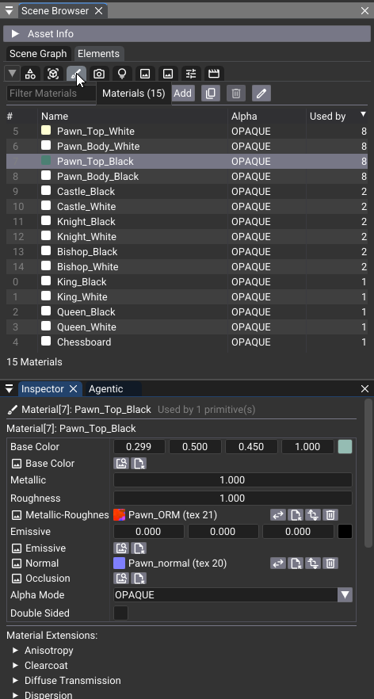

The **Inspector** panel provides full PBR material editing when a material or primitive is selected:

- Base color factor and texture, metallic, roughness, emissive (factor + strength)
- Normal map scale, occlusion strength, alpha mode and cutoff
- Double-sided toggle
- All glTF PBR material extensions: clearcoat, transmission, volume, volume scatter, sheen, specular, IOR, iridescence, anisotropy, diffuse transmission, dispersion, emissive strength, unlit, and retroreflection
- Material copy/paste via clipboard (right-click on materials)

Each extension gets its own collapsible section at the bottom of the material Inspector. A material that
doesn't carry the extension shows a single **Add** button, which attaches it with spec-default values and
expands the section; once present, the section instead shows its fields plus a **Remove** button, which
detaches the extension (and its data) from the material. Adding or removing an extension is a normal,
undoable material edit, like any field change above it.

`KHR_materials_pbrSpecularGlossiness` is a read/edit-only exception to this: a material that already
carries it shows its diffuse/specular/glossiness fields in place of the metallic-roughness ones above, but
the extension itself has no Add/Remove control — this renderer edits specular-glossiness materials it
loads, it does not author new ones.

Each texture slot shows a thumbnail of the assigned image — click it to open the full-size **image
viewer** — and offers **switch** to another existing texture (a filterable, thumbnailed picker), **load
from file** (import a new image — available even on a scene that starts with no textures), **clear**, and
a **UV transform** button. The transform button opens
a small popup for `KHR_texture_transform` (offset, rotation, scale): glTF stores the transform on the
material's texture *reference* — not the shared texture — so it is edited here per binding, and the same
texture used by two materials can carry two different transforms. The button offers **Add** when the
extension is absent, then the fields plus **Remove**. Imported images are referenced externally and copied
next to the file on save.

### Textures, Images, and Samplers

The **Elements** tab lists **Textures**, **Images**, and **Samplers** with thumbnails alongside the text
(text stays the fastest way to find one in large scenes), and selecting a row edits it in the **Inspector**.
The **Textures** list shows each texture's image resolution and sampler summary; its Inspector edits the
`{ source, sampler }` indices (matching the glTF texture object) and the referenced sampler's wrap/filter
inline. The **Samplers** list shows wrap/filter and how many textures use each; its Inspector edits the
wrap and filter modes. The per-binding UV transform is edited from the material Inspector (above). The
**Images** list reports each image's resolution and how many textures reference it — sort by resolution to
find the heaviest textures, and the footer totals the decoded texture memory. The Image Inspector opens the
full **image viewer** and can **replace from file** or **reload**; an image that no texture references can be
deleted from the toolbar (refcount-gated). Other unused resources are cleared by **Compact Scene** (`Ctrl+K`).

### Lights

The editor supports two kinds of lights, both visible in the unified **Lights** list in the Elements tab:

- **KHR_lights_punctual** — point, directional, and spot lights. Created from the node hierarchy context menu or the **Add ▾** button on the Lights element list.
- **EXT_lights_ies** — standalone photometric lights whose angular distribution comes from an IESNA LM-63 `.ies` file. These are loaded from the glTF; they do not require a `KHR_lights_punctual` companion.

**Creating KHR punctual lights:**

- Right-click any node in the hierarchy and select **Add Child → Light → Point / Directional / Spot Light**
- Right-click the Scene root and select **Add → Light → Point / Directional / Spot Light**
- Use **Add ▾** on the Elements tab's **Lights** (or **Nodes**) category

Each light is created as a new node in the scene graph. Position and orient the light by editing the node's transform (inspector or gizmo).

**Editing KHR light properties:**

When a KHR light is selected, the Inspector shows:

| Property | Applies to | Description |
|---|---|---|
| **Type** | All | Switch between point, directional, and spot |
| **Color** | All | Light color (edited in sRGB, stored as linear) |
| **Intensity** | All | Brightness multiplier |
| **Range** | Point, Spot | Maximum range of the light (0 = infinite) |
| **Inner Cone Angle** | Spot | Angle of full-intensity cone (radians) |
| **Outer Cone Angle** | Spot | Angle of light falloff cone (radians) |

All light property edits are undoable.

**Deleting lights:** Select the light's node in the hierarchy and delete it (`Del`). Use **Tools > Compact Scene** to remove orphaned light definitions from the file.

### IES Photometric Profiles

[EXT_lights_ies](https://github.com/KhronosGroup/glTF/tree/main/extensions/2.0/Vendor/EXT_lights_ies)
replaces a light's smooth falloff with the angular distribution measured from a real luminaire —
a ring downlight, a barn-door spot, a wide scatter fixture, and so on. The profile is an
IESNA LM-63 `.ies` file referenced by the glTF — either embedded as a bufferView or as an
external `.ies` URI alongside the `.gltf` file.

Different profiles produce dramatically different results on the same geometry:

| Ring + scatter | Tight beam + umbrella | X-arrow + jellyfish | Parallel beam + comet |
|---|---|---|---|
| 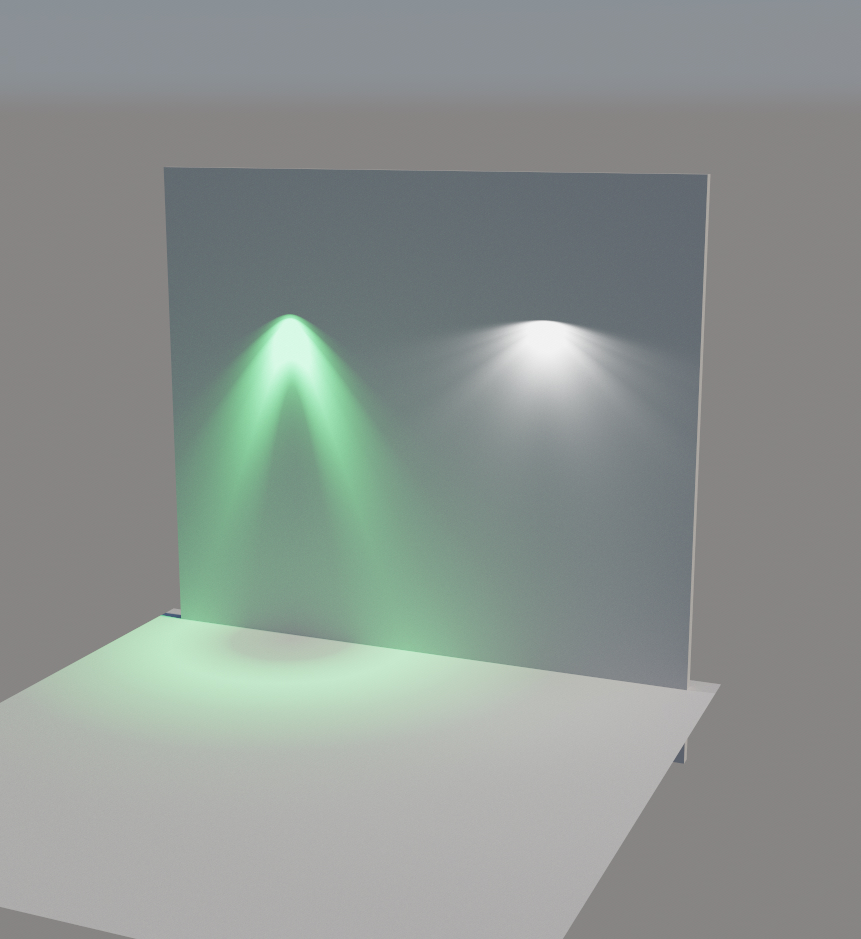 | 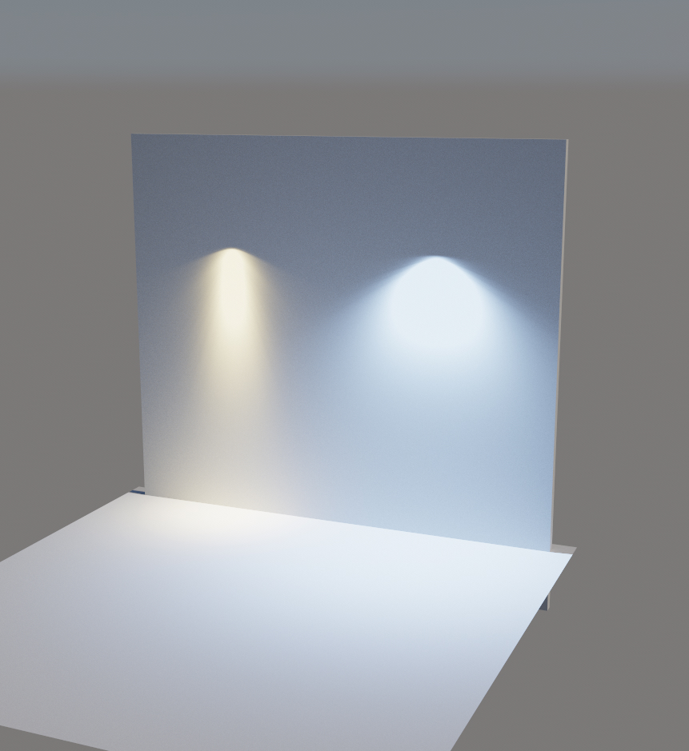 | 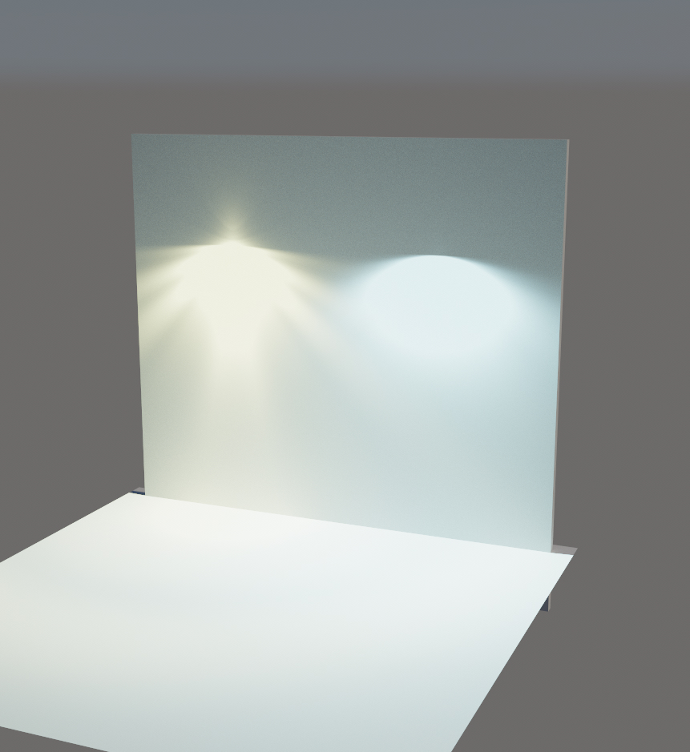 | 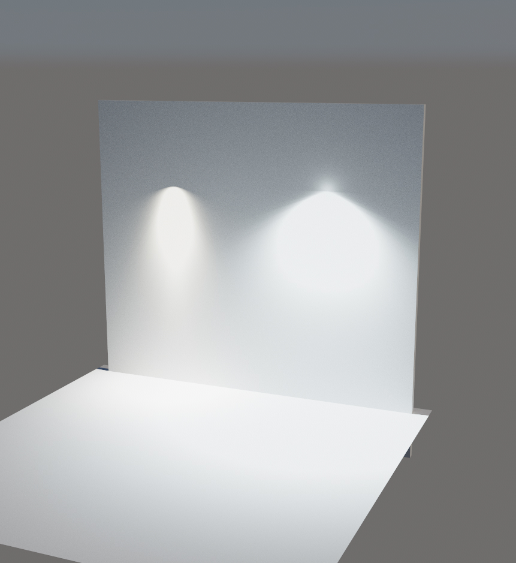 |

When an IES node is selected, the Inspector shows an **IES LIGHT** section with editable
**Multiplier** (brightness scale) and **Color** (linear RGB tint). Both are undoable. The
profile itself is read-only — it refers to the `.ies` file the scene was saved with.

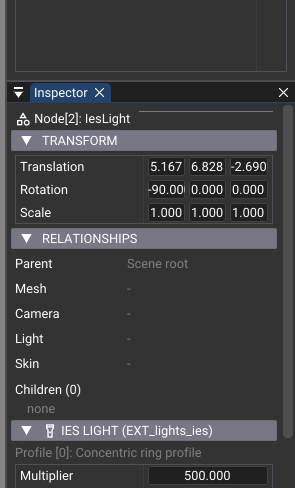

### Scene Merging

Multiple glTF files can be combined into a single scene:

- **File > Import/Merge Scene...** opens a file dialog to select a `.gltf` or `.glb` file (embeds it into the current scene, or opens it as a new scene if none is loaded)
- **Shift + Drag & Drop** a file onto the viewport to merge instead of replace
- Merged content is wrapped under a new root node, preserving both scenes' hierarchies
- To bring a merged scene to the same scale, select its new root node and type the real-world size of the object into **Dimensions (m)** (e.g. a helicopter that measures 60 units, typed as 15, gets a scale of 0.25)
- Texture count is validated against the GPU descriptor limit before merging

To keep external files as **references** (glTF 2.1 external assets) instead of embedding them,
use **File > Reference Scene...** or **Ctrl+Shift + Drag & Drop**. Referenced assets stay
read-only, repeated references share geometry, and the links are preserved on save. Use the
context-menu **Make Editable** to break the lock on a referenced subtree, and
**File > Save Self-Contained As...** to bake references inline into a portable file. See
[External Assets](external_assets.md) for details.

### Save and Compact

- **File > Save / Save As** writes the modified scene to `.gltf` or `.glb`, including all edits (transforms, hierarchy changes, material tweaks, merged content, image copying)
- **Tools > Compact Scene** removes orphaned resources (unused meshes, materials, textures, images, accessors, buffer views, buffers) left behind by delete/merge operations and consolidates all geometry into a single buffer — reduces file size, cleans up the model, and collapses the extra buffers that editor operations (e.g. adding a primitive) leave behind. Pre-baked `EXT_mesh_opacity_micromap` data is preserved through compaction so OMM coverage survives the save/compact workflow.

### Visibility

Nodes with the `KHR_node_visibility` extension can be toggled visible/hidden directly from the hierarchy. Visibility propagates to children and is reflected in both renderers immediately.

### Selectability & Hoverability

The Inspector's node **Transform** panel exposes two interaction flags, next to **Visible**:

- **Selectable** (`KHR_node_selectability`) — when unchecked, clicking the node (or any of its children) in the viewport no longer selects it. Selection instead falls through to the nearest selectable ancestor, or is cleared if none exists. This lets an author mark decorative or grouping geometry as non-pickable while still selecting the meaningful parent object.
- **Hoverable** (`KHR_node_hoverability`) — a companion flag intended for hover interactions (primarily consumed by `KHR_interactivity`). It is parsed, editable, and preserved on save.

Both flags cascade to the whole subtree (a `false` on an ancestor disables its descendants) and default to enabled. Use **Add Selectability** / **Add Hoverability** to attach the extension to a node that does not yet carry it.

### Interactivity

Scenes with a `KHR_interactivity` behavior graph run it automatically on load; see
[docs/interactivity.md](interactivity.md) for which nodes are supported. A Play/Pause button appears
in the viewport toolbar whenever the scene has a graph.

**View → Windows → Interactivity** (**F8**) has the controls: Play/Pause, **Reset** (restart with
fresh state), live stats, the current variable values, **Send Event** to fire a custom event, and
the graph's `debug/log` output.

A scene with a graph doesn't autoplay its animations, since the graph controls them, but you can
still scrub. While the graph plays, every viewport click re-selects and fires `event/onSelect`, so
buttons and levers respond to each click; pause the graph for normal click behavior.

Test scenes: [glTF-Test-Assets-Interactivity](https://github.com/KhronosGroup/glTF-Test-Assets-Interactivity)
has the Khronos samples, and the [Needle glTF Interactivity Editor](https://gltf-interactivity.needle.tools/)
authors new ones; see [docs/resources.md](resources.md).

---

## Animation

If the loaded scene contains animations, an animation strip appears along the bottom of the viewport:

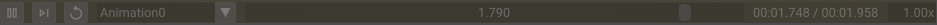

- **Play / Pause** the active animation (`Space`)
- **Step** forward one frame at a time
- **Reset** to the beginning
- Pick the **animation clip** when the scene has more than one
- Adjust **playback speed** (0 to 100x, default 1x)
- **Timeline scrubbing** — drag the slider to any time position

Supported animation types: keyframe translation/rotation/scale, skeletal skinning, morph targets, and `KHR_animation_pointer` (animated material and light properties).

## Multiple Scenes

If the glTF file contains multiple scenes, a **Multiple Scenes** section appears at the bottom of the **Settings** panel. Pick a scene to switch.

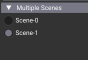

## Material Variants

If the scene uses `KHR_materials_variants`, a **Material Variants** section at the top of the **Scene Browser** lists every variant name. Click one to apply it to all meshes that support it.

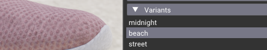

---

## Debug Visualization

Inspect individual material channels to diagnose shading issues:

|metallic|roughness|normal|base color|emissive|opacity|tangent|tex coord|
|---|---|---|---|---|---|---|---|
|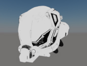|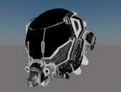|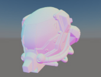|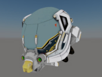|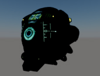|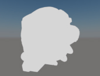|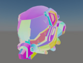|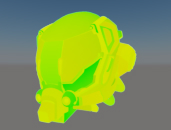|

Select the visualization mode from the **Visualization** combo in the **Settings** panel. The full set of modes is defined by `shaderio::Visualization` in `shaders/shaderio.h`. See also the [Opacity Micromap](#opacity-micromap-ext_mesh_opacity_micromap) section for the OMM coverage debug view.

---

## Material Feature Showcase

The ray tracing path tracer implements all glTF PBR material extensions with physically accurate results. Here is a selection of material features in action:

| | |
|--|--|
| Anisotropy | 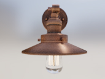 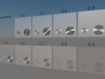 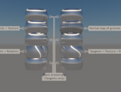 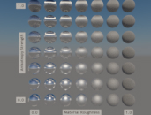 <br> 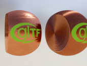|
| Attenuation | 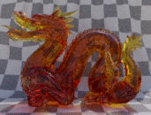 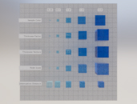|
| Alpha Blend | 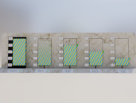 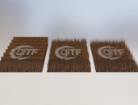 |
| Clear Coat | 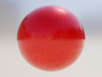 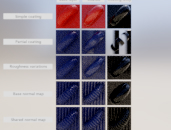 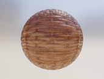 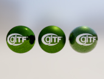|
| Dispersion | 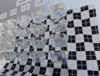 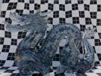 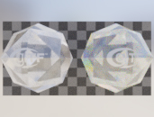 |
| IOR | 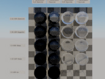 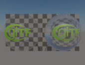 |
| Emissive | 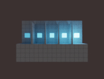 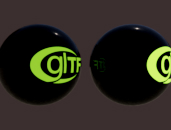 |
| Iridescence | 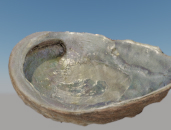 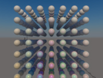 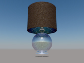 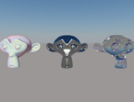 |
| Punctual Lights | 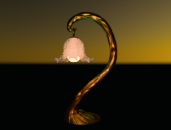 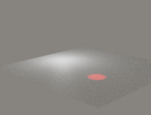 |
| Sheen | 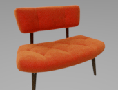 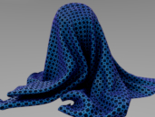 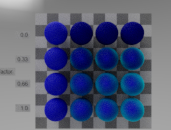 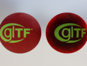 |
| Transmission | 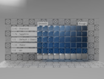 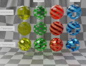 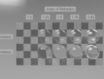 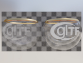 <br> 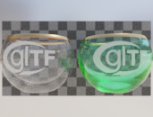 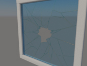 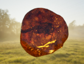 |
| Volume | 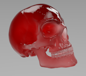 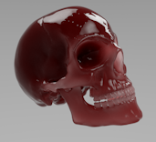 |
| Variant | 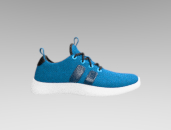 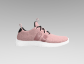 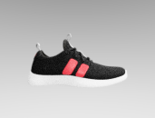 |
| Others | 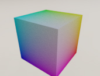 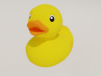 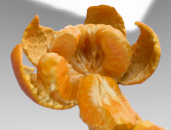 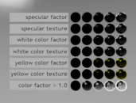 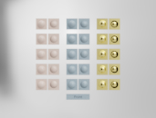 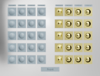 <br> 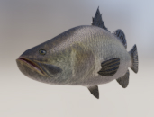 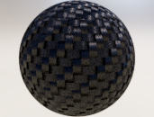 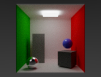 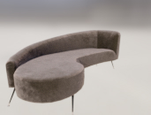 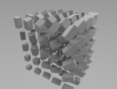 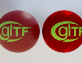 |

---

## Tools

### GPU Profiler

Measure time spent on each rendering stage (path tracing, rasterization, tone mapping, UI) with per-frame GPU timestamps.

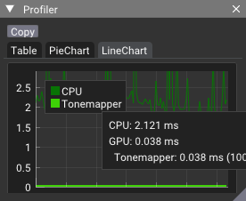

### Logger

A dockable log window showing all application messages. Filter by level (Info, Warning, Error) to focus on what matters.

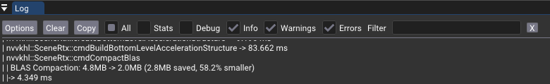

### NVML GPU Monitor

Real-time GPU monitoring via NVML: temperature, power draw, memory usage, and clock speeds. Useful for identifying thermal throttling during long renders.

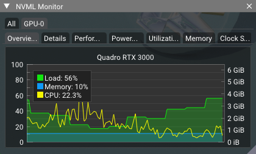

### Tangent Space Repair

Repair or regenerate the model's tangent space when normal maps look incorrect or tangent-related validation errors appear.

| Method | Description |
|---|---|
| **Simple** | UV gradient method — fast, good for most cases. Based on [Foundations of Game Engine Development](https://foundationsofgameenginedev.com/FGED2-sample.pdf). |
| **MikkTSpace** | Industry-standard algorithm from [mikktspace.com](http://www.mikktspace.com/). Handles UV seams correctly with vertex splitting. |

### Shader Hot-Reload

Press **Ctrl+Shift+R** or use `Tools > Reload Shaders` to hot-reload all Slang shaders without restarting the application. Shader source files in the `shaders/` directory are recompiled on-the-fly, making it ideal for rapid shader development and debugging.

> **Note:** Hot-reload requires the Slang compiler and shader source files to be accessible at runtime (handled automatically by the build system's `copy_to_runtime_and_install`).

### Exporting Images

| Action | Shortcut | Description |
|---|---|---|
| **Save Image** | `Ctrl+Alt+I` | Save the current tonemapped render to a PNG file (alpha channel preserved for compositing). |
| **Save Screen Image** | `Ctrl+Alt+Shift+I` | Save a screenshot of the full application window including UI. |

Both are also available from **File > Save Image** and **File > Save Screen Image**.

### Memory Statistics

Open via **Windows > Memory Usage**. Displays GPU memory allocation broken down by category (textures, buffers, acceleration structures, etc.). Useful for tracking memory consumption on large scenes.

### Presentation Mode

Press **F11** (or **View > Presentation Mode**) to show the viewport alone: every panel, the menu bar
and the toolbar are hidden, and the window becomes borderless and covers the whole monitor it is on.
It is a borderless window rather than exclusive full screen, so **Alt-Tab** to another application
(e.g. slides on a second screen) and back is instant. Camera navigation works as usual, and
**Home** flies back to the home camera (this works in the viewport outside presentation mode too).

Press **F11** or **Esc** to leave: the panels, the menu bar, and the window's position, size and
maximized state come back exactly as they were. The hidden layout is never written to the `.ini`,
and closing the application while presenting restores the layout first, so the next launch is
unaffected. It can also be turned on from the command line (`--presentationMode 1`), a benchmark
script, or MCP (`presentationMode`); it is ignored in headless runs.

### Resetting the UI and Settings

Two entries at the bottom of the **Windows** menu put the application back to a known state without
having to quit and delete the `.ini`:

- **Reset UI Layout** — re-docks every panel where a fresh run puts it, leaving all settings alone.
  Use it after a panel has been dragged somewhere unhelpful or ended up floating off-screen.
- **Reset All to Default** — asks for confirmation, then returns every setting to its built-in
  default *and* restores the default layout: the state of a first launch with no `.ini`. The loaded
  scene, its edits, and the loaded environment image stay as they are -- but every *setting* resets,
  including the ones that drive the environment (sky vs. HDR, lighting, background), so the image
  can visibly change. This is not undoable with `Ctrl+Z`.

Both are also reachable from a script, a benchmark sequence, or MCP as `--resetUiLayout` and
`--resetAllToDefault`, which is how the behavior is exercised in a scripted UI run.

---

## Configuration

### Settings File

The application creates a `vk_gltf_renderer.ini` file next to the executable, which persists:

- UI layout and window positions (via ImGui)
- User preferences (axis visibility, grid display, gizmo state)
- Selected renderer type (path tracer or rasterizer)
- Path tracer settings (technique, adaptive sampling, performance target)
- DLSS settings (enable, size mode)
- Last used environment and rendering options

If you encounter UI issues or want to reset all settings to defaults, use **Windows > Reset All to
Default** (see above), or quit and delete this file — it is recreated with default values on the
next launch.

### Command-Line Reference

Every setting can be set from the command line as `--name value`. For the full list, with types and
ranges, run:

```bash
vk_gltf_renderer --help
```

The list is generated from the settings themselves, so it is always current. The same names work in
`--configfile` files and benchmark scripts.

Headless render:

```bash
vk_gltf_renderer --headless --scenefile shader_ball.gltf --hdrfile daytime.hdr --envSystem 1 --frames 1000 --output render.jpg
```

Scripted benchmark:

```bash
vk_gltf_renderer --benchmark 1 --size 1920 1080 --sequencefile utils/benchmark/quick.cfg \
  --scenefile shader_ball.gltf --hdrfile std_env.hdr
```

See [Benchmarking](benchmarking.md) for headless A/B timing and the script format. The optional
image-generation bridge (`--agenticBridgeRoot`, `--agenticBridgeInit`, and the **Agentic** window
on F7) is covered in [ComfyUI Agentic Setup](comfyui-agentic-setup.md).

---

## Utilities

### gltf-material-modifier.py

Located in `utils/gltf-material-modifier.py`. A Python 3 script to batch-modify materials in a glTF file and optionally reorient the scene from Z-up to Y-up.

```
usage: gltf-material-modifier.py [-h] [--metallic METALLIC] [--roughness ROUGHNESS] [--override] [--reorient]
                                 input_file output_file
```

| Argument | Description |
|---|---|
| `input_file` | Path to the input glTF file |
| `output_file` | Path to save the modified glTF file |
| `--metallic` | Set metallic factor (default: 0.1) |
| `--roughness` | Set roughness factor (default: 0.1) |
| `--override` | Override existing material values |
| `--reorient` | Reorient the scene from Z-up to Y-up |

---

## Troubleshooting

**Application won't start / black screen**
- Ensure you have an NVIDIA RTX GPU with up-to-date drivers (535+).
- Verify the Vulkan SDK is installed: run `vulkaninfo` from a terminal.
- Try with validation layers: `--vvl` to get detailed Vulkan error messages.

**DLSS not available**
- DLSS requires an RTX 20-series or newer GPU and the `USE_DLSS=ON` CMake option.
- Check that the NGX runtime is present; it is downloaded automatically during the build.
- The application will still run with DLSS disabled if hardware support is missing.

**OptiX AI Denoiser not working**
- Ensure the [CUDA Toolkit](https://developer.nvidia.com/cuda-downloads) is installed and found by CMake.
- On Windows, `cudart64_*.dll` is delay-loaded — the application starts without it, but the denoiser tab will show as unavailable.
- OptiX headers are auto-downloaded; no separate OptiX SDK install is needed.

**Shader hot-reload fails (Ctrl+Shift+R)**
- Hot-reload requires the Slang compiler and shader source files to be accessible at runtime.
- Verify the `shaders/` directory is present next to the executable (handled by `copy_to_runtime_and_install`).

**Resetting UI layout**
- Delete the `vk_gltf_renderer.ini` file next to the executable. It will be recreated with defaults on the next launch.
