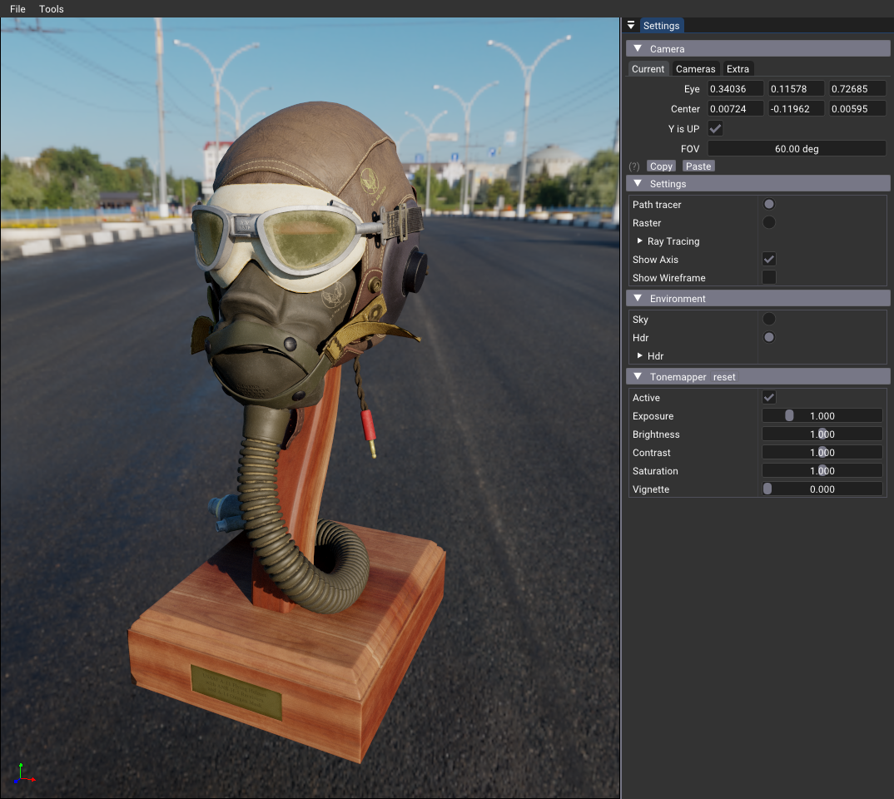
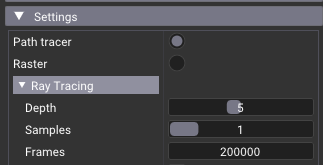
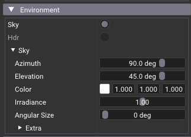
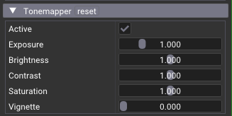

# glTF Simple

This sample is a glTF scene renderer which can render using Vulkan rasterizer and ray tracer with global illumination (path tracer). The functionality is mpt complete, but offers enough to be a starting point for many other examples.

## Loading Scenes

Loading a scene can be done using an argument: `gltf_viewer.exe --filename path_to_scene\a_scene.gltf`, using the Menu > File Open, or drag&drop a glTF scene.

## Functionalities

**Rendering Mode**

Select raster or ray tracing, and ray tracing settings

**Cameras**

Position and camera manipulation style. 
Double click set the center of interest.

**Environment**

Clear color, tone mapping and 2 default lights.

 

## Schema of the Program

The `main()` is adding all the extensions which is needed for this application and where the `Raytracing` class is created. 

### onAttach()
In `onAttach()` we are creating many helpers, such as

* **nvvk::DebugUtil** : utility for setting debug information visible in Nsight Graphics
* **AllocVma** : the allocator of resources based on VMA, for images, buffers, BLAS/TLAS
* **Scene** : the glTF scene, loaded with tiny_gltf and data ajusted for our needs.
* **SceneVk** : the Vulkan version of Scene, basically vertices and indices in buffers, textures uploaded.
* **SceneRtx** : the version of Scene for ray tracing, BLAS/TLAS using information from SceneVk
* **TonemapperPostProcess** : a tonemapper post-process
* **nvvk::SBTWrapper** : an helper to create the Shading Binding Table
* **SkyPass** : creates a synthetic sky, for both raster and ray tracing.
* **nvvk::RayPickerKHR** : tool that sends a ray and return hit infomation.
* **nvvk::AxisVK** : show a 3D axis in the bottom left corner of the screen
* **HdrEnv** : loads HDR and pre compute the importance acceleration structure sampling information.
* **HdrEnvDome** : pre-convolute the diffuse and specular contrubution for raster HDR lighting.

### onDetach()

Will destroy all allocated resources

### onUIMenu()

Will be modifying what we see in the the window title. It will also create the menu, like `File`, `Help` and deal with some key combinations.

### onFileDrop()

Will receive the path of the file been dropped on. If it is a .gltf, .glb or .hdr, it will load that file. 

### onUIRender()

This is all the GUI rendering, the settings that can be changed. It is also there where we display the rendered image. The redered image is a UI component wich is covering the Viewport window. 

### onRender()

Called with the frame command buffer, sets the information used by shaders in some buffers, then either call `raytraceScene(cmd)` or `rasterScene(cmd)`.

Tonemapper is applied to the rendered image, and axis draw on top of the final image.

# HDR Sampling

Ray tracing

Raster

Having HDRi (High Dynamic Range Imaging) to illuminate the scene greatly simplifies complex lighting environments. It also helps to integrate 3D objects into its environment.

This example loads HDR images, then creates an importance sampling acceleration structure used by the ray tracer and stores the [PDF](https://en.wikipedia.org/wiki/Probability_density_function) in the alpha channel of the RGBA32F image.

For real-time rendering, we use the created acceleration structure and create two cubemaps. One containing the diffuse irradiance and the other, storing the glossy reflection, where different levels of glossiness are stored in different mipmap levels.

## Generation

For ray tracing, only the first step of loading and creating the acceleration structure is needed. This is done in [hdr_env.cpp](src/hdr_env.cpp). The technique is described in the source.

For real-time, we use the information created above to generate 2 cubemap and also creating a BRDF lookup table, which will be use to determine the level of glossy to apply. The generation of the cubemaps are done using compute shaders ([diffuse](/advance/common/shaders/hdr_prefilter_diffuse.comp), [glossy](/advance/common/shaders/hdr_prefilter_glossy.comp)). The invocation of the shaders is done in [hdr_env_dome.cpp](/advance/common/hdr_env.cpp).

## Dome

For real-time rendering, there is no `miss` shader where we can sample the HDR. Therefore, we replace the cleared color pass. We modified the render pass (`m_offscreenRenderPass`) to no longer erase the color channels. Then, before calling the raster render pass, we call `drawDome()` which calls a compute shader ([hdr_dome](/advance/common/shaders/hdr_dome.comp)) and replaces all the pixels with the HDR image, respecting the camera viewpoint.

# Resources

HDRi : <https://polyhaven.com/>
